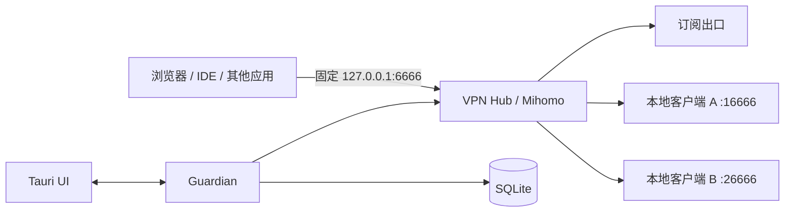

# VPN Hub

面向 Windows 的本地多出口 VPN/代理编排客户端。它计划把一个远程订阅和多个已安装客户端统一接入一个稳定入口，并提供健康检测、自动切换和历史记录。

> 当前状态：方案已 Review，Phase 0 已确认本地客户端 A 可在 `16666` 与现有 `6666` 出口并行运行；开发 Mihomo 链路已在隔离端口 `36666` 验证。仓库暂不提供可运行安装包。

## 核心约束

| 项目 | 约定 |
|---|---|
| 对外入口 | 永久保持 `127.0.0.1:6666` |
| 上游客户端 A | 内部 Mixed Port `127.0.0.1:16666` |
| 上游客户端 B | 内部 Mixed Port `127.0.0.1:26666` |
| 编排核心 | 官方 Mihomo sidecar |
| 桌面端 | Tauri 2 + React/TypeScript |
| 守护与检测 | Rust Guardian |
| 历史记录 | SQLite WAL |
| 默认出口顺序 | 远程订阅 → 本地客户端 A → 本地客户端 B |
| 全部出口失效 | Fail Closed，禁止静默直连 |



## 文档导航

| 文档 | 内容 |
|---|---|
| [完整设计方案](docs/design.md) | 架构、路由、健康检测、数据库、UI、安全和验收标准 |
| [已确认决策](docs/decisions.md) | Review 后锁定的默认选择与不可变约束 |
| [实施路线图](docs/roadmap.md) | 从兼容性验证到正式发行的阶段计划 |
| [开发安全边界](docs/development.md) | 如何在不接管现有 `6666` 的前提下开发和测试 |
| [Guardian 设计与使用](docs/guardian.md) | Rust 健康检测、SQLite 状态机和 CLI 使用方法 |
| [Mihomo 开发隔离](docs/mihomo-development.md) | 校验 sidecar 并在 `36666` 验证本地编排链路 |
| [兼容性实测](docs/compatibility/2026-07-18-chaoshihui.md) | 本地客户端 A 使用 `16666` 的首轮验证证据 |
| [Mihomo 链路实测](docs/compatibility/2026-07-18-mihomo-chain.md) | `36666 → Mihomo → 16666` 的隔离验证证据 |
| [贡献指南](CONTRIBUTING.md) | 如何提交兼容性报告和代码变更 |
| [安全策略](SECURITY.md) | 敏感配置处理和漏洞报告规则 |

## 当前优先事项

Phase 0 已证明本地客户端 A 可以暴露 `16666`，并与当前占用 `6666` 的本地客户端 B 同时运行。剩余硬门槛是把客户端 B 迁移到 `26666`，并完成 UDP、长时间稳定性与重启恢复验证。在迁移完成前，开发环境不得绑定、关闭或修改 `6666`。

## Guardian CLI

当前已提供不修改系统代理的 Rust Guardian 原型。开发配置只探测 `127.0.0.1:16666`：

```powershell
cargo run -p vpn-hub-cli -- check --config config/development.toml
cargo run -p vpn-hub-cli -- monitor --config config/development.toml --cycles 5
cargo run -p vpn-hub-cli -- summary --database data/guardian-dev.db
```

Guardian 只输出和保存字段白名单，不会记录订阅 URL、节点地址、认证信息、访问目标历史或流量正文。

## 非目标

- 不提供或转售 VPN 服务、账号、节点和订阅。
- 不破解第三方客户端、加密配置或私有协议。
- 不记录用户访问的网站、域名或连接目标。
- 不承诺现有 TCP、QUIC、游戏或视频连接无缝迁移。
- 不做单连接多线路带宽聚合。

## 合规说明

本项目只负责管理用户自行合法取得并有权使用的本地代理出口。使用者应自行遵守所在地法律法规、服务商条款和网络管理政策。

## 许可证

本仓库自行编写的代码和文档采用 [MIT License](LICENSE)。Mihomo 及其他第三方组件保持各自许可证；发布二进制包前必须完成第三方许可证清单和 NOTICE 文件。
