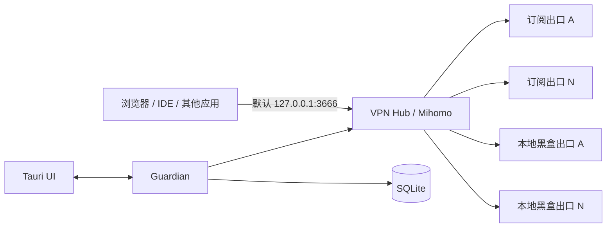

# VPN Hub

面向 Windows 的本地多出口代理编排客户端。它把任意数量的订阅和本地黑盒代理统一接入一个可配置入口，并提供健康检测、自动切换和历史记录。

> 当前状态：桌面端已使用版本化配置驱动统一入口、动态出口、Guardian、Mihomo 与 UI。默认开发入口是 `127.0.0.1:3666`；应用不会修改系统代理、TUN 或第三方客户端。

## 核心约束

| 项目 | 约定 |
|---|---|
| 对外入口 | 默认 `127.0.0.1:3666`，可配置为其他空闲 loopback 端口 |
| 订阅出口 | 一条订阅对应一个逻辑出口；配置只保存 `secret_ref` |
| 本地黑盒出口 | 任意数量的 `http` / `socks5` / `socks5h` loopback endpoint |
| 编排核心 | 官方 Mihomo sidecar |
| 桌面端 | Tauri 2 + React/TypeScript |
| 守护与检测 | Rust Guardian |
| 历史记录 | SQLite WAL |
| 默认出口顺序 | 按版本化配置中启用出口的数组顺序 |
| 全部出口失效 | Fail Closed，禁止静默直连 |



## 文档导航

| 文档 | 内容 |
|---|---|
| [完整设计方案](docs/design.md) | 架构、路由、健康检测、数据库、UI、安全和验收标准 |
| [已确认决策](docs/decisions.md) | Review 后锁定的默认选择与不可变约束 |
| [实施路线图](docs/roadmap.md) | 从兼容性验证到正式发行的阶段计划 |
| [开发安全边界](docs/development.md) | 如何在不接管现有 `6666` 的前提下开发和测试 |
| [Guardian 设计与使用](docs/guardian.md) | Rust 健康检测、SQLite 状态机和 CLI 使用方法 |
| [Mihomo 开发隔离](docs/mihomo-development.md) | 校验 sidecar 并在 `36666` 验证本地编排链路 |
| [Issue #3 双出口开发版](docs/issue-3-dual-outlet.md) | 私密订阅、真实 Controller 策略、多目标健康与 Fail Closed |
| [Issue #7 动态入口与出口](docs/issue-7-dynamic-outlets.md) | 版本化配置、动态 Mihomo/Guardian/UI、兼容迁移与回滚 |
| [Issue #6 Windows 受保护凭据](docs/issue-6-windows-secret-store.md) | 多订阅 Secret Store、旧明文迁移、状态与生命周期 |
| [Issue #29 订阅节点选择](docs/issue-29-subscription-node-selection.md) | Mihomo 订阅节点的运行时读取、搜索、手动选择与隐私边界 |
| [Issue #5 动态多出口隔离故障验收](docs/issue-5-dynamic-fault-acceptance.md) | 随机端口、多订阅/本地出口故障、恢复阈值与 all-down 证据 |
| [Issue #14 可选 TUN 与回滚](docs/issue-14-dynamic-tun.md) | Windows 能力门禁、进程身份策略、事务 journal、DNS/路由恢复与隔离验收缺口 |
| [Issue #43 小而精界面](docs/issue-43-small-app-ui.md) | 移除低频/不可用常驻模块，把活动出口安全选择收进删除与停用动作 |
| [兼容性实测](docs/compatibility/2026-07-18-local-client.md) | 本地客户端 A 使用 `16666` 的首轮验证证据 |
| [Mihomo 链路实测](docs/compatibility/2026-07-18-mihomo-chain.md) | `36666 → Mihomo → 16666` 的隔离验证证据 |
| [Issue #3 Controller 实测](docs/compatibility/2026-07-18-issue-3-local-controller.md) | 初始 REJECT、真实选择器和 `36666 → 16666` HTTPS 证据 |
| [桌面 UI 设计系统](docs/desktop-design-system.md) | 视觉概念、正确端口值、组件和响应式约束 |
| [桌面端视觉验收](docs/qa/desktop-fidelity-ledger.md) | 概念图与浏览器实装的逐项对照结果 |
| [贡献指南](CONTRIBUTING.md) | 如何提交兼容性报告和代码变更 |
| [安全策略](SECURITY.md) | 敏感配置处理和漏洞报告规则 |

## 当前优先事项

动态配置已接入 Windows 受保护凭据存储；当前主线聚焦快速配置与连接、精简桌面主路径，以及多出口安全回归。历史兼容性文档中的 `16666`、`26666`、`36666` 是当时测试拓扑，不再是产品固定端口。

## Guardian CLI

当前已提供不修改系统代理的 Rust Guardian 原型。开发配置只探测 `127.0.0.1:16666`：

```powershell
cargo run -p vpn-hub-cli -- check --config config/development.toml
cargo run -p vpn-hub-cli -- monitor --config config/development.toml --cycles 5
cargo run -p vpn-hub-cli -- summary --database data/guardian-dev.db
```

Guardian 只输出和保存字段白名单，不会记录订阅 URL、节点地址、认证信息、访问目标历史或流量正文。

## Desktop App

桌面端位于 `apps/desktop`，由 React/Vite 前端和 Tauri 2 Rust 后端组成。它目前提供：

| 能力 | 当前实现 |
|---|---|
| 入口管理 | 从版本化配置读取 loopback 地址与端口，默认 `127.0.0.1:3666`；启动前拒绝冲突 |
| Guardian | 对配置中的所有启用出口进行动态探测，默认每 180 秒执行一次 |
| 历史展示 | 出口汇总、延迟趋势、稳定状态事件和 Controller 确认切换 |
| Mihomo | 只启动/停止本应用创建的配置入口进程；Controller 仅 loopback 且使用随机 secret |
| 动态路由 | 任意数量订阅与本地出口；优先级、最低延迟、手动均驱动真实选择器，全部失败时 `REJECT` |
| 订阅节点 | 节点选择页从本机 Mihomo Controller 临时读取候选并手动切换，不持久化节点信息 |
| UDP 边界 | 出口表展示 `supported / tcp_only / unknown` 证据；桌面端不要求普通用户提供外部 UDP Echo，缺少证据时保持 `REJECT` |
| 产品边界 | 当前桌面端不提供 TUN 入口；plan-only 基础仍由 Issue #14 跟踪，但生产 Windows backend 未实现 |
| 安全边界 | 不修改系统代理、不实际启用 TUN、不自行安装 Service、不扫描或控制第三方客户端 |

开发运行：

```powershell
cd apps/desktop
npm install
npm run tauri dev
```

在仓库根目录构建 Windows 主程序和安装包：

```powershell
npm run build
```

主程序输出到 `target/release/vpn-hub-desktop.exe`，安装包输出到 `target/release/bundle/nsis/`。根目录脚本会调用 `apps/desktop` 中锁定的 Tauri CLI。Mihomo 二进制不提交到仓库；在当前开发阶段，启动开发核心前仍需先运行 `scripts/fetch-mihomo.ps1`。

真实订阅地址只能通过桌面总览的密码输入框写入 `%LOCALAPPDATA%\VPN Hub`。不要把它放入仓库配置、命令行、日志、Issue 或 PR。

## 非目标

- 不提供或转售 VPN 服务、账号、节点和订阅。
- 不破解第三方客户端、加密配置或私有协议。
- 不记录用户访问的网站、域名或连接目标。
- 不承诺现有 TCP、QUIC、游戏或视频连接无缝迁移。
- 不做单连接多线路带宽聚合。

## 合规说明

本项目只负责管理用户自行合法取得并有权使用的本地代理出口。使用者应自行遵守所在地法律法规、服务商条款和网络管理政策。

## 许可证

本仓库自行编写的代码和文档采用 [MIT License](LICENSE)。Mihomo 及其他第三方组件保持各自许可证；发布二进制包前必须完成第三方许可证清单和 NOTICE 文件。
