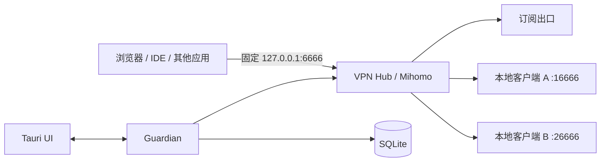

# VPN Hub

面向 Windows 的本地多出口 VPN/代理编排客户端。它计划把一个远程订阅和多个已安装客户端统一接入一个稳定入口，并提供健康检测、自动切换和历史记录。

> 当前状态：方案已 Review，正在进行 Phase 0 兼容性验证。仓库暂不提供可运行安装包。

## 核心约束

| 项目 | 约定 |
|---|---|
| 对外入口 | 永久保持 `127.0.0.1:6666` |
| 上游客户端 A | 内部 Mixed Port `127.0.0.1:16666` |
| 上游客户端 B | 内部 Mixed Port `127.0.0.1:26666` |
| 编排核心 | 官方 Mihomo sidecar |
| 桌面端 | Tauri 2 + React/TypeScript |
| 守护与检测 | Rust Guardian |
| 历史记录 | SQLite WAL |
| 默认出口顺序 | 远程订阅 → 本地客户端 A → 本地客户端 B |
| 全部出口失效 | Fail Closed，禁止静默直连 |

## 文档导航

| 文档 | 内容 |
|---|---|
| [完整设计方案](docs/design.md) | 架构、路由、健康检测、数据库、UI、安全和验收标准 |
| [已确认决策](docs/decisions.md) | Review 后锁定的默认选择与不可变约束 |
| [实施路线图](docs/roadmap.md) | 从兼容性验证到正式发行的阶段计划 |
| [贡献指南](CONTRIBUTING.md) | 如何提交兼容性报告和代码变更 |
| [安全策略](SECURITY.md) | 敏感配置处理和漏洞报告规则 |

## 当前优先事项

Phase 0 必须先证明两个外部客户端可以同时运行，并分别暴露 `16666` 和 `26666`。如果客户端强制占用 `6666`，同一 Windows 网络命名空间内的并行编排就不成立，需要厂商支持、虚拟机隔离或改为顺序切换。

## 非目标

- 不提供或转售 VPN 服务、账号、节点和订阅。
- 不破解第三方客户端、加密配置或私有协议。
- 不记录用户访问的网站、域名或连接目标。
- 不承诺现有 TCP、QUIC、游戏或视频连接无缝迁移。
- 不做单连接多线路带宽聚合。

## 合规说明

本项目只负责管理用户自行合法取得并有权使用的本地代理出口。使用者应自行遵守所在地法律法规、服务商条款和网络管理政策。

## 许可证

本仓库自行编写的代码和文档采用 [MIT License](LICENSE)。Mihomo 及其他第三方组件保持各自许可证；发布二进制包前必须完成第三方许可证清单和 NOTICE 文件。
