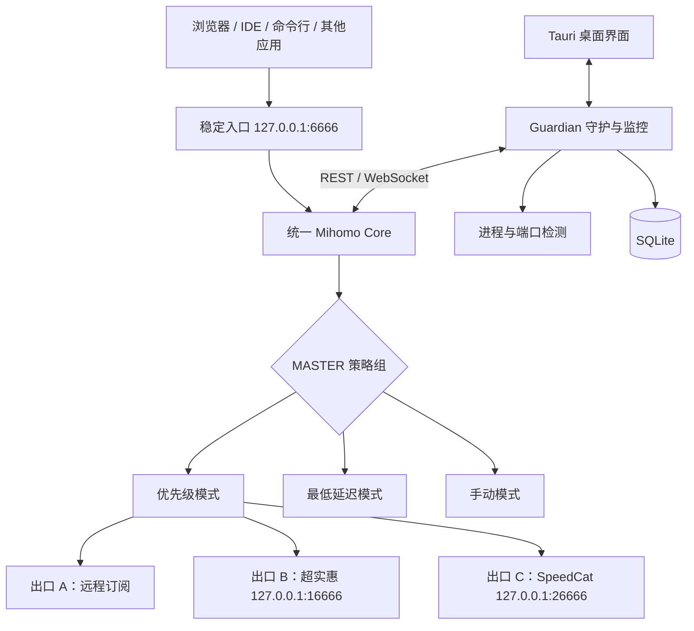
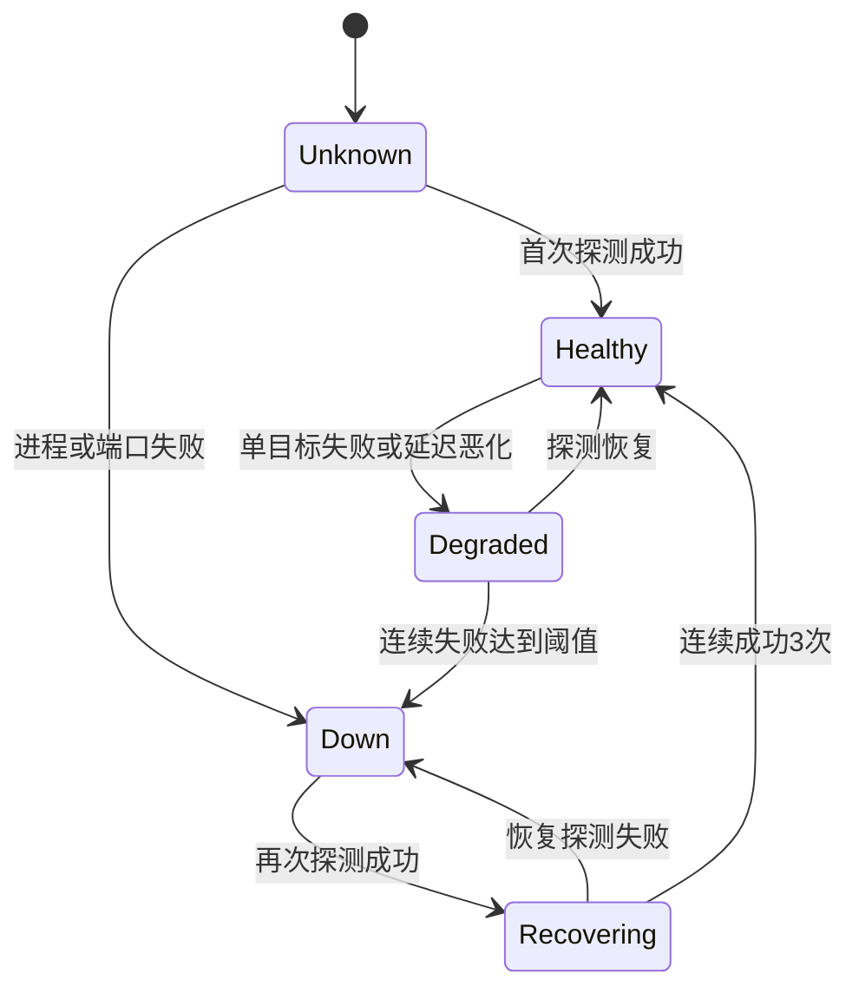
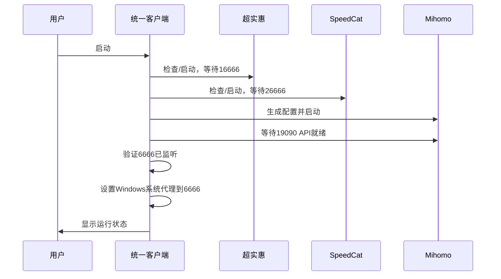

# 本地多出口 VPN 编排客户端完整方案

> 公开版说明：本文中的客户端名称和进程名来自单台测试机器，仅作为兼容性研究样本，不代表其厂商提供或支持第三方控制接口。仓库不包含任何真实订阅地址、账号或节点。

> 架构状态：早期章节保留固定三出口和 `6666` 接管方案作为设计历史；当前实现以 [Issue #7 动态出口模型](issue-7-dynamic-outlets.md) 为准，即入口和本地出口端口均可配置、默认入口为 `127.0.0.1:3666`。入口切换、可选用户代理与崩溃恢复以 [Issue #12 安全入口切换](issue-12-safe-entry-switch.md) 为准。当前历史 schema 与统计口径见第 10 节和 [Issue #8 历史分析](issue-8-history-analytics.md)。

> 状态：已 Review，进入 Phase 0
> 目标平台：Windows 10/11
> 文档日期：2026-07-18
## 1. 方案结论

本项目可实现，但必须区分两个层次：

1. **统一流量、测速、故障切换和历史记录**：可以实现，且不依赖两个独立客户端开放控制 API。
2. **控制两个独立客户端内部更新节点、选择节点和重连**：当前无法保证。它们包含 Clash.Meta/Mihomo 能力，但没有暴露已确认可用的标准 REST API，现阶段应作为黑盒本地代理出口接入。

最终应用必须永久占用：

```text
127.0.0.1:6666
```

用户现有浏览器、IDE、终端和其他应用继续使用该地址，无需重新配置。

上游出口改为内部端口：

| 组件 | 地址 | 对用户可见 | 说明 |
|---|---:|---:|---|
| 统一客户端 Mihomo Mixed Port | `127.0.0.1:6666` | 是 | 唯一稳定入口，永久保留 |
| 超实惠内部 Mixed Port | `127.0.0.1:16666` | 否 | 仅由统一客户端访问 |
| SpeedCat 内部 Mixed Port | `127.0.0.1:26666` | 否 | 仅由统一客户端访问 |
| 统一客户端控制 API | `127.0.0.1:19090` | 否 | 随机密钥保护，仅本机访问 |

## 2. 已确认事实、推测和待验证项

| 分类 | 内容 |
|---|---|
| 已确认 | 超实惠版本为 2.2.4，核心进程为 `chaoshihuiCore.exe` |
| 已确认 | SpeedCat Lite 版本为 3.0.3，核心进程为 `SpeedCatCore.exe` |
| 已确认 | 两者当前都使用 `127.0.0.1:6666` 作为 Mixed Port |
| 已确认 | 两个核心都包含 Clash.Meta/Mihomo、SOCKS5、Mixed Port 和标准 API 路由代码 |
| 已确认 | 两个客户端的本地配置对象源自 FlClash 架构或高度相似的衍生架构 |
| 已确认 | 本地配置模型包含可覆写的 `mixed-port`、`allow-lan`、`tun.enable` 和 `external-controller` 字段 |
| 已确认 | 当前未发现可直接访问的标准 HTTP 控制 API |
| 已确认 | SpeedCat 存在 `\\.\pipe\SpeedCat` 命名管道，但普通用户连接被拒绝 |
| 合理推测 | 两个客户端是基于 FlClash 改造的白标客户端，并使用私有 GUI/Core IPC |
| 待验证 | 两个客户端的设置页能否直接修改 Mixed Port |
| 待验证 | 两个客户端同时运行时是否还存在端口、服务、TUN 或账号层冲突 |
| 待验证 | 两个内部 Mixed Port 的 SOCKS5 UDP 是否可用 |
| 待验证 | 订阅源实际返回 Clash YAML、Base64 还是其他格式 |
| 待验证 | 两个客户端是否有厂商提供但未公开展示的 API/CLI |

## 3. 项目目标

### 3.1 必须实现

- 对外永久提供 `127.0.0.1:6666`。
- 同时接入一个远程订阅出口和两个本地客户端出口。
- 支持优先级、最低延迟、手动锁定三种模式。
- 当前出口失效时自动切换。
- 恢复后按策略切回或保持当前出口。
- 记录每个出口的延迟、可用率、断线时间和切换事件。
- 提供表格、趋势图和故障时间线。
- 可检测并显示两个独立客户端的进程和端口状态。
- 统一客户端退出或异常时，不修改已有应用的代理地址。
- 默认全部出口失效时阻断代理流量，防止静默直连泄漏。

### 3.2 第一版不做

- 不逆向破解两个客户端的加密配置。
- 不依赖私有命名管道或私有 IPC。
- 不通过 UI 自动化点击客户端内部按钮。
- 不承诺已有 TCP、QUIC、游戏或视频连接无缝迁移。
- 不做单连接三线路带宽聚合。
- 不默认做多出口负载均衡。
- 不收集用户访问网站、域名或连接目标历史。
- 不做云端账号、远程管理和多用户系统。

## 4. 总体架构



### 4.1 组件职责

| 组件 | 技术 | 职责 |
|---|---|---|
| Desktop UI | Tauri 2 + React/TypeScript | 设置、状态表、图表、托盘和通知 |
| Guardian | Rust | 健康检测、事件归并、进程监控、配置生成 |
| Network Core | 官方 Mihomo Sidecar | Mixed Port、TUN、路由、订阅、策略组、测速 |
| Storage | SQLite WAL | 延迟样本、故障事件、切换记录、日统计 |
| Secret Store | Windows Credential Manager/DPAPI | 订阅 URL、API Secret、代理认证信息 |
| Optional Helper | Windows LocalSystem Service | 正式版管理 TUN 权限和核心自动拉起 |

## 5. 为什么统一客户端应独占 6666

`6666` 是兼容性入口，不应和某个具体供应商绑定：

```text
以前：应用 → 6666 → 当前打开的某一家客户端

以后：应用 → 6666 → 统一客户端 → A / B / C
```

这样可以获得以下结果：

- 已保存 `127.0.0.1:6666` 的应用完全不用修改。
- 上游供应商切换不会改变应用配置。
- 更换或新增供应商时，入口仍保持不变。
- 健康检查、记录和路由策略只在统一客户端内实现。

## 6. 上游客户端接入方式

### 6.1 超实惠和 SpeedCat

两者都只作为本地代理出口运行：

| 设置 | 超实惠 | SpeedCat |
|---|---:|---:|
| Mixed Port | `16666` | `26666` |
| 系统代理 | 关闭 | 关闭 |
| 虚拟网卡/TUN | 关闭 | 关闭 |
| 穿透模式/Allow LAN | 关闭 | 关闭 |
| 链式代理 | 关闭 | 关闭 |
| 自动登录 | 开启 | 开启 |
| 自动连接 | 如果支持则开启 | 如果支持则开启 |

统一 Mihomo 将它们声明为 SOCKS5 本地出站：

```yaml
proxies:
  - name: OUT-CHAOSHIHUI
    type: socks5
    server: 127.0.0.1
    port: 16666
    udp: true

  - name: OUT-SPEEDCAT
    type: socks5
    server: 127.0.0.1
    port: 26666
    udp: true
```

如果 UDP 验证失败，客户端将为对应出口标记 `TCP only`，并避免把明确需要 UDP 的流量路由过去。

### 6.2 订阅出口

订阅交给统一客户端管理，不再交给两个白标客户端：

```yaml
proxy-providers:
  SUBSCRIPTION-A:
    type: http
    url: "<从凭据库注入>"
    path: ./providers/subscription-a.yaml
    interval: 3600
    health-check:
      enable: true
      url: https://cp.cloudflare.com
      interval: 180
      timeout: 5000
      lazy: false
```

正式实现不应把订阅 URL 输出到日志或 UI。运行时配置文件需要设置仅当前用户可读的 ACL。

## 7. 路由和防循环

### 7.1 所有权原则

| 系统能力 | 唯一所有者 |
|---|---|
| `127.0.0.1:6666` | 统一 Mihomo |
| Windows 系统代理 | 统一客户端 |
| Windows TUN/虚拟网卡 | 统一客户端 |
| DNS 劫持 | 统一 Mihomo |
| 内部端口 16666 | 超实惠 |
| 内部端口 26666 | SpeedCat |

### 7.2 Windows TUN 防递归能力门禁

旧方案曾用固定供应商进程名、固定端口和 Mihomo `PROCESS-NAME,...,DIRECT` 作为防递归规则。该方案已经废弃：产品支持动态出口，进程名可以伪造，PID 会复用，端口也不是进程身份；更关键的是，Mihomo 官方 TUN 文档没有提供 Windows 按进程排除字段。普通路由规则不能证明 Windows 应用身份，也不能作为安全边界。

当前规则由 `vpn-hub-helper::tun` 的 typed `TunPlan` 表达，并在能力不足时 Fail Closed：

| 角色 | 身份来源 | 网络 disposition |
|---|---|---|
| GUI / Helper | 当前安装签名工件的绝对路径 + SHA-256 | 外网拒绝，仅保留必要 loopback 控制面；不得获得泛化 bypass |
| VPN Hub Core | 当前安装拥有的 Core 工件身份 | 仅允许计划内上游 transport |
| `subscription` 出口 | 稳定 outlet ID；凭据不进入计划 | 不需要本地进程排除；业务与 DNS 仍受 Fail Closed 策略约束 |
| `local_proxy` 出口 | 稳定 outlet ID + 明确 loopback endpoint + 用户登记的绝对路径/SHA-256 | 仅该已登记基础设施客户端可获得最小 bypass；不扫描或控制其他进程 |

只有 Windows backend 能把 WFP/ALE normalized application identity 与实际 TUN/packet-routing executor 协同起来落实上述 disposition，且能同时快照和恢复 IPv4/IPv6 路由、DNS、适配器与 TUN 状态时，才允许启用。普通 WFP permit/block 只做授权或阻断，并不会自动让流量绕过 TUN 路由，不能单独视为 transport bypass。缺任一能力、身份不匹配或全部出口失效时，IPv4/IPv6 × TCP/UDP/DNS 均拒绝真实网络直连；不能退化为进程名、PID、固定端口或全局 `DIRECT`。

## 8. 策略组设计

```yaml
proxy-groups:
  - name: A-AUTO
    type: url-test
    use:
      - SUBSCRIPTION-A
    url: https://cp.cloudflare.com
    interval: 180
    tolerance: 80

  - name: PRIORITY
    type: fallback
    proxies:
      - A-AUTO
      - OUT-CHAOSHIHUI
      - OUT-SPEEDCAT
    url: https://cp.cloudflare.com
    interval: 30
    lazy: false

  - name: FASTEST
    type: url-test
    proxies:
      - A-AUTO
      - OUT-CHAOSHIHUI
      - OUT-SPEEDCAT
    url: https://cp.cloudflare.com
    interval: 60
    tolerance: 80

  - name: MASTER
    type: select
    proxies:
      - PRIORITY
      - FASTEST
      - A-AUTO
      - OUT-CHAOSHIHUI
      - OUT-SPEEDCAT
```

### 8.1 用户模式

| 模式 | 行为 | 默认性 |
|---|---|---:|
| 优先级 | A 可用用 A；A 失败用超实惠；再失败用 SpeedCat | 默认 |
| 最低延迟 | 在三个顶层出口间选择较低延迟出口 | 可选 |
| 手动锁定 | 固定使用 A、超实惠或 SpeedCat | 可选 |
| 负载均衡 | 不同新连接分散到不同出口 | 第一版不提供 |

### 8.2 故障恢复策略

提供两个选项：

| 策略 | 行为 |
|---|---|
| 自动回切 | 高优先级出口稳定恢复后切回 |
| 保持当前 | 故障切走后维持现有出口，直到用户切换或其再次故障 |

默认使用“自动回切”，但恢复出口必须连续成功 3 次并经过 5 分钟冷却期，避免频繁抖动。

## 9. 健康检测

### 9.1 四层检测

| 层级 | 检测内容 | 说明 |
|---|---|---|
| 进程 | GUI/Core 是否运行 | 发现崩溃或未启动 |
| 端口 | 16666/26666 是否监听 | 发现本地代理未就绪 |
| 路径 | 通过指定出口请求探测 URL | 发现隧道、DNS或上游故障 |
| 质量 | 延迟、连续失败和超时 | 判断退化和抖动 |

### 9.2 推荐周期

| 检测项 | 默认值 |
|---|---:|
| 当前使用出口 | 15 秒 |
| 备用顶层出口 | 30 秒 |
| 进程/端口 | 5 秒 |
| 订阅内部节点 | 180 秒 |
| 订阅列表更新 | 1 小时 |
| 延迟历史采样 | 60 秒 |
| 故障阈值 | 连续失败 2 次 |
| 恢复阈值 | 连续成功 3 次 |
| 自动回切冷却 | 5 分钟 |

### 9.3 多目标防误判

不能只用一个检测网站。Guardian 交替或组合检测：

```text
https://cp.cloudflare.com
https://www.gstatic.com/generate_204
用户自定义业务 URL（可选）
```

判断原则：

- 本地端口失败：直接判定出口不可用。
- 一个外部目标失败、另一个成功：标记为 `DEGRADED`，不立即切换。
- 两个独立目标连续失败：判定 `DOWN`。
- 当前出口 `DOWN`：立即触发或确认 Mihomo 已完成切换。

### 9.4 状态机



## 10. 历史记录和数据模型

### 10.1 数据表

| 表 | 关键字段 | 用途 |
|---|---|---|
| `outlets` | `id,label,kind,enabled,deleted_at` | 稳定出口目录；删除使用墓碑 |
| `probe_samples` | `observed_at,outlet_id,status,latency_ms,label/kind snapshot` | 脱敏延迟和健康样本 |
| `state_events` | `occurred_at,outlet_id,from_status,to_status,reason` | 故障与恢复边界 |
| `route_switches` | `occurred_at,from_outlet,to_outlet,mode,reason` | Controller 已确认的真实切换 |
| `udp_capability_history/current` | 版本化结论和 current 引用 | 与 TCP 健康独立的 UDP 证据 |
| `history_settings` | `retention_days` | 本机历史保留期 |

订阅 URL、密码、令牌不进入 SQLite。

### 10.2 保存周期

| 数据 | 保存时间 |
|---|---:|
| 原始健康样本 | 默认 30 天，可设置 1–3650 天 |
| 故障事件 | 同一保留期；进行中故障的最新边界不清理 |
| 切换事件 | 同一保留期 |
| UDP 证据 | 同一保留期；current 引用永不被清理 |

三个出口每 180 秒采样一次，一个月约 43,200 条记录；索引、后端分页和流式 CSV 的规模测试覆盖该体量。

## 11. UI 规划

### 11.1 首页

| 出口 | 状态 | 当前延迟 | 24h 在线率 | P50/P95 | 最近断线 | 当前使用 |
|---|---|---:|---:|---:|---|---:|
| 订阅 A | 正常 | 82ms | 99.8% | 75/130ms | 14:32，48秒 | 是 |
| 超实惠 | 备用 | 119ms | 98.7% | 105/260ms | 昨日 22:10 | 否 |
| SpeedCat | 恢复中 | — | 96.2% | 180/490ms | 10:17 | 否 |

首页同时显示：

- 用户配置的本机入口状态（未配置时默认 `127.0.0.1:3666`）。
- 当前稳定出口 ID 和脱敏显示名称，不显示订阅节点。
- 动态出口状态表，不记录或展示历史公网出口 IP。
- 当前策略：优先级/最快/手动。
- 24 小时延迟折线图。
- 最近故障和最近切换。

### 11.2 历史页

- 延迟趋势图：1h、24h、7d、30d。
- 可用率对比表。
- 故障时间线。
- 切换事件表。
- 按稳定出口、kind、状态、事件类型和时间范围筛选。
- 防公式注入的脱敏流式 CSV 导出。
- 已删除出口标识和 1–3650 天保留策略。

### 11.3 设置页

- 多订阅管理。
- 动态出口优先级拖拽。
- 检测 URL 和周期。
- 自动回切/保持当前。
- 全部失败时“阻断”或“允许直连”。
- 本地黑盒客户端出口及其 loopback 端口。
- 系统代理和 TUN。
- 数据保存周期。

## 12. 启停和异常恢复

### 12.1 正常启动



### 12.2 正常退出

- 用户选择“仅关闭窗口”：应用进入托盘，核心继续运行。
- 用户选择“停止代理”：恢复启动前的 Windows 系统代理设置。
- 用户选择“退出程序”：停止 Mihomo；是否停止两家客户端由设置决定。

### 12.3 崩溃恢复

- Guardian 每 5 秒检查 Mihomo 进程和 6666 监听状态。
- Mihomo 崩溃时自动拉起，采用指数退避。
- 连续拉起失败时通知用户。
- 默认不把 Windows 系统代理自动改为 DIRECT，以防真实出口泄漏。
- 提供显式“紧急恢复网络”按钮，恢复启动前系统代理。

## 13. 安全设计

| 风险 | 处理方式 |
|---|---|
| 订阅 URL 泄漏 | 存 Windows Credential Manager/DPAPI，日志统一脱敏 |
| 本地 API 被调用 | 仅绑定 127.0.0.1，使用随机 Bearer Secret |
| 6666 被局域网访问 | 默认只监听 127.0.0.1，不开启 Allow LAN |
| 全部出口失败后真实 IP 泄漏 | 默认 Fail Closed，不自动 DIRECT |
| DNS 泄漏 | DNS 由统一 Mihomo 接管并遵守路由规则 |
| 循环代理 | GUI/Helper 外网拒绝；Core 仅允许计划内上游；只有已登记的本地客户端基础设施可按 normalized application identity 精确 bypass；未知进程不扫描、不放行 |
| 浏览历史泄漏 | 不持久化真实访问目标，只保存人工探测结果 |
| 明文运行配置 | 当前用户 ACL；正式版支持 DPAPI 加密静态配置 |
| DLL/核心被替换 | 版本锁定、SHA-256 校验和受信更新源 |

## 14. 许可证和分发

- Mihomo 使用 GPLv3。
- FlClash 使用 GPLv3，两个白标客户端很可能基于其代码，但其合规情况不属于本项目假设范围。
- 个人本地自用风险较低。
- 如果统一客户端公开分发或商业化，需在正式发布前完成许可证评审，提供必要的许可证、源码获取方式和修改声明。
- 第一版应把 Mihomo 作为未修改独立 Sidecar，通过进程/API交互，不直接复制 FlClash UI 代码。

## 15. 实施阶段

### Phase 0：兼容性闸门

目标：证明两个白标客户端能同时作为独立出口运行。

验收条件：

- 超实惠成功改为 `16666`。
- SpeedCat 成功改为 `26666`。
- 两个客户端系统代理、TUN 和穿透模式均关闭。
- 两个核心能同时运行至少 2 小时。
- 分别通过两个端口访问探测网站成功。
- 两个端口显示不同或符合预期的公网出口。
- 关闭任一客户端不会影响另一端口。
- 验证 TCP；单独记录 UDP 是否支持。

**若无法修改内部端口，本方案在“同时在线”目标上被阻断。**备选只能是：

1. 启停切换两个客户端，无法保持同时在线；或
2. 将客户端放入独立虚拟机/网络隔离环境，复杂度显著增加；或
3. 获得厂商提供的端口配置/API支持。

### Phase 1：Headless POC

- 下载并锁定官方 Mihomo 版本。
- 创建最小配置。
- 6666 作为统一入口。
- 接入订阅 A、16666 和 26666。
- 建立 PRIORITY、FASTEST、MASTER 组。
- 验证手动切换。
- 人为关闭三个出口分别验证自动切换。
- 验证全部失败时不会 DIRECT。
- 验证现有应用不需要修改 6666。

### Phase 2：Guardian 与历史库

- 实现进程、端口、路径和延迟检测。
- 实现健康状态机。
- 建立 SQLite Schema。
- 记录 incident 和 switch event。
- 日统计聚合。
- CSV 导出。

### Phase 3：桌面客户端

- Tauri 界面和托盘。
- 首页状态表和延迟图表。
- 故障时间线。
- 配置向导。
- 系统代理控制。
- Windows Toast 通知。
- 安全停止和代理恢复。

### Phase 4：TUN、服务与发布

- 最小权限 LocalService Helper Service。
- 可选 TUN 的能力门禁、事务 journal 和防循环规则；当前生产 Windows adapter 明确 `unsupported`，未修改本机网络。
- Mihomo 自动拉起。
- 凭据库和配置 ACL。
- 安装、升级、卸载和恢复测试。
- 许可证和发布材料。

## 16. 验收测试矩阵

| 场景 | 预期结果 |
|---|---|
| 统一客户端启动 | 6666 成功监听，原有应用无需改配置 |
| 订阅 A 节点失败 | A 内部换节点；必要时切到超实惠 |
| 订阅 A 全部失败 | 自动切到超实惠并记录事件 |
| 超实惠 Core 退出 | 端口检测失败，切到下一出口并创建 incident |
| SpeedCat 端口存在但无法联网 | 路径检测失败，不能误判为健康 |
| 检测网站之一故障 | 标记 Degraded，不立即切换 |
| 当前出口恢复 | 连续成功并经过冷却后按策略回切 |
| 三个出口全部失败 | 6666 保持存在但请求失败，不静默直连 |
| Mihomo 崩溃 | Guardian 自动拉起并记录 Core 事件 |
| 电脑睡眠后恢复 | 重检端口、DNS、路由和出口状态 |
| Wi-Fi 切换 | 重新检测物理接口和全部出口 |
| TUN 请求启用 | 未具备 WFP/ALE 应用身份排除和完整恢复能力时明确 unsupported 并保持关闭 |
| TUN 隔离验收 | 已登记 Core / local client 不递归；GUI/Helper 无泛化 bypass；未知进程不被扫描或修改 |
| 应用退出 | 按用户选择恢复原系统代理或留在托盘 |
| 数据库损坏 | 备份损坏文件并重建，代理核心仍可运行 |

## 17. Review 决策点

请重点 Review 以下选择：

1. `6666` 是否确认由统一客户端永久独占。
2. 默认优先级是否为：订阅 A → 超实惠 → SpeedCat。
3. 全部出口失败时是否确认默认阻断，不允许自动直连。
4. 恢复后默认自动切回，还是保持当前可用出口。
5. 第一版是否只做系统代理，TUN 放到后续阶段。
6. 是否接受两个白标客户端第一版只作为黑盒出口，不控制其内部节点。
7. 原始健康记录保存 30 天、日统计长期保存是否合适。
8. 是否需要统一客户端自动启动和自动关闭两个白标客户端。

## 18. 推荐的最终决策

建议采用以下默认值：

| 决策项 | 推荐值 |
|---|---|
| 稳定入口 | `127.0.0.1:6666` |
| 默认策略 | 优先级模式 |
| 默认优先级 | 订阅 A → 超实惠 → SpeedCat |
| 故障策略 | Fail Closed |
| 恢复策略 | 连续成功 3 次 + 5 分钟后自动回切 |
| 第一版接管方式 | Windows 系统代理 |
| TUN | Phase 4 再启用 |
| 两个白标客户端 | 黑盒端口适配器 |
| API/IPC 逆向 | 非核心、后续实验项 |
| 原始数据保存 | 30 天 |
| 浏览目标记录 | 不保存 |

## 19. 参考资料

- [Mihomo 外部控制/API 配置](https://wiki.metacubex.one/en/config/general/)
- [Mihomo API](https://wiki.metacubex.one/en/api/)
- [Mihomo Proxy Providers](https://wiki.metacubex.one/en/config/proxy-providers/)
- [Mihomo Fallback](https://wiki.metacubex.one/en/config/proxy-groups/fallback/)
- [Mihomo SOCKS5 出站](https://wiki.metacubex.one/en/config/proxies/socks/)
- [FlClash 项目](https://github.com/chen08209/FlClash)
- [Tauri Sidecar](https://v2.tauri.app/develop/sidecar/)
