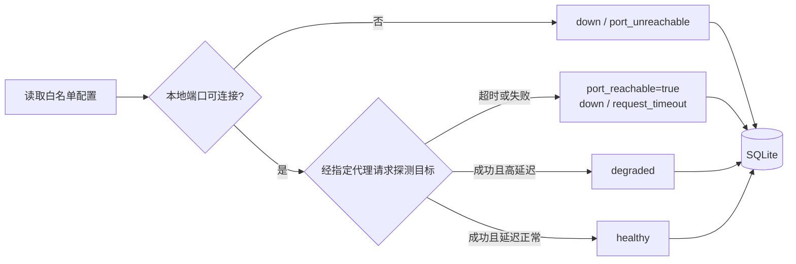

# Guardian 设计与使用

Guardian 是 VPN Hub 的本地健康检测与历史记录核心。目前以 Rust library + CLI 形式提供，后续由 Tauri 桌面端复用同一核心。

## 安全边界

Guardian 当前只允许配置回环地址上的 HTTP/SOCKS5 代理出口。它不会：

- 设置或清除 Windows 系统代理；
- 创建 TUN；
- 启动、停止或重启第三方客户端；
- 绑定产品入口端口；
- 读取第三方客户端配置、账号或订阅；
- 保存探测 URL 或代理 URL 到数据库。

## 检测层次



端口打开只能证明第三方核心在运行，不能证明实际出口可达。2026-07-18 的现场验证已经出现“`16666` 打开但海外探测路径超时”的状态，Guardian 会明确保留两层结果。

## 状态机

| 状态 | 含义 |
|---|---|
| `unknown` | 尚无样本 |
| `healthy` | 探测成功且低于退化阈值 |
| `degraded` | 探测成功但延迟超过阈值 |
| `down` | 端口不可达、代理连接失败、请求超时或状态码异常 |

初始样本会建立基线状态。运行中连续失败达到 `failure_threshold` 才从可用状态转为 `down`；从 `down` 恢复必须连续成功达到 `recovery_threshold`。

## SQLite 数据

| 表 | 用途 | 敏感字段策略 |
|---|---|---|
| `outlets` | 出口 ID、显示名称 | 不保存代理 URL |
| `probe_samples` | 时间、端口状态、HTTP 状态、延迟、错误码 | 不保存探测 URL、目标 IP 或错误原文 |
| `outlet_state` | 当前状态和连续成功/失败次数 | 只保存状态机数据 |
| `state_events` | 断开、恢复、退化事件 | reason 是固定错误码 |

数据库启用 WAL；开发数据库位于 `data/`，已被 `.gitignore` 排除。

## 命令

### 单次检查

```powershell
cargo run -p vpn-hub-cli -- check --config config/development.toml
```

退出码：

| 代码 | 含义 |
|---:|---|
| `0` | 本轮没有 `down` 出口 |
| `1` | 配置、数据库或程序错误 |
| `2` | 至少一个出口检测为 `down` |

### 定时监测

```powershell
cargo run -p vpn-hub-cli -- monitor --config config/development.toml
```

使用 `--cycles N` 可以限制轮数，省略时按 Ctrl+C 停止。

### 汇总

```powershell
cargo run -p vpn-hub-cli -- summary --database data/guardian-dev.db
```

三个命令均支持 `--json`，供未来 Tauri 后端或其他自动化工具消费。

## 当前限制

- 当前每个出口使用一个明确的探测目标，尚未实现多目标仲裁。
- 尚未实现 P50/P95、原始样本自动保留期限和事件持续时间归并。
- 尚未实现进程检查和 SOCKS5 UDP 检测。
- Guardian 只检测，不执行自动切换；切换由后续 Mihomo 编排层负责。
