# Issue #12：可配置统一入口与用户代理安全切换

> 状态：事务模型、当前用户 DPAPI 保护日志、WinINet 适配器和禁用态 UI 已实现；真实执行入口仍关闭。由于 WinINet 没有原子 compare-and-set，本阶段是 partial foundation，不能关闭 Issue #12。

## 已确认边界

| 项目 | 结论 |
|---|---|
| 入口 | 默认 `127.0.0.1:3666`；用户可选择任意合法 loopback 端口，`6666` 只是可能的用户配置 |
| 普通设置保存 | 入口字段只读；检测到入口变化必须拒绝，并转入独立的“安全入口切换”流程 |
| 端口冲突 | 仅允许空闲端口或与当前 generation 匹配的 exact-owned core；unknown/third-party 一律拒绝且不终止进程 |
| 系统代理 | 仅在用户明确 opt-in 后由当前交互用户执行；LocalService 不读取、不写入、不恢复用户代理 |
| 网络范围 | 只表达 default LAN/current interactive user；service、RAS/VPN、命名连接、多连接均 fail closed |
| 非目标 | 不启用 TUN，不修改路由、DNS、防火墙，不操作第三方客户端，不承诺长连接无缝迁移 |

## 授权与机密恢复状态

| 资产 | 保护方式 |
|---|---|
| Consent | 120 秒一次性 opaque token；HMAC-SHA256 绑定 `install_id`、`user_scope_id`、generation、当前/目标入口、完整原始/目标代理快照、签发/过期时间和随机 token id |
| HMAC key | 只从当前用户 Windows protected store 读取；类型不实现 `Debug`、`Clone` 或序列化，内存退出时 zeroize |
| Recovery journal | 完整 payload 先做 installation-bound HMAC，再用当前用户 DPAPI 加密；DPAPI 禁止 UI 且不使用 machine scope |
| UI / audit DTO | 只包含入口、布尔值、指纹、generation 和 token id；不包含 manual proxy、PAC URL 或 bypass 内容 |
| 存储路径 | 只能从已校验的 `InstallationReference` 派生固定路径；校验 root、目录、authority、journal 的 owner/DACL、reparse point 和文件 identity |

消费记录与恢复记录位于同一份加密状态中，并在同一个 OS authority lock 下原子更新。清理只删除已过期 token id，不通过容量滚动淘汰未过期记录。

## 事务顺序

```mermaid
flowchart LR
  A["持有交互用户 OS authority lock"] --> B["校验 keyed consent 与 trusted clock"]
  B --> C["同锁消费一次性 token"]
  C --> D["journal: Prepared"]
  D --> E["预声明 transaction id + ownership token"]
  E --> F["journal: StagePending"]
  F --> G["启动 exact-owned core"]
  G --> H["journal: Staged"]
  H --> I["验证 Controller、出口与 Fail Closed"]
  I --> J["journal: EntryCommitPending"]
  J --> K["提交应用入口"]
  K --> L{"用户 opt-in 系统代理?"}
  L -- "否" --> M["持锁清理 journal"]
  L -- "是" --> N["journal: ProxyApplyPending"]
  N --> O["query → compare → WinINet apply"]
  O --> P["SETTINGS_CHANGED + REFRESH + query verify"]
  P --> M
```

`StagePending` 必须在启动 effect 前落盘，且包含可定位的 exact-owned identity 声明。即使进程在启动后、保存 PID 前崩溃，恢复也只能按预声明 ownership token 停止本事务创建的对象。

恢复时会重新验证 journal HMAC、完整 plan、phase invariants、generation、installation 和 user authority scope。authority guard 从 load/consume 一直持有到 clear，不能用普通数据结构伪造。

## WinINet 并发限制

当前接口明确命名为 `compare_then_apply`，不是 CAS：

1. 先 query 当前 default-LAN 快照并比较指纹；
2. 再调用 WinINet 写入；
3. 广播 `INTERNET_OPTION_SETTINGS_CHANGED`、`INTERNET_OPTION_REFRESH`；
4. 最后 query-back 精确验证。

比较和写入之间存在不可消除的竞争窗口。恢复同样只在当前值仍等于本应用写入值时尝试恢复原快照；若观察到第三种值，则保留 journal 并拒绝覆盖。即使如此，也无法把 WinINet 操作宣称为原子，因此生产/UI 执行不能启用，直到隔离验收证明协调策略可接受或另有可靠的串行化方案。

## 当前开放条件

生产 adapter 虽可编译，但没有 Tauri command，UI 执行按钮保持 disabled。开放前必须在一次性 Windows 测试用户或虚拟机完成：

1. 证明当前进程身份与目标交互用户、user-scope identity 和 DPAPI scope 一致；
2. 验证 fixed path 的 owner/DACL、reparse/replacement 防护及跨用户/跨安装解密失败；
3. 用随机隔离 loopback 端口完成 ownership、Controller、出口、Fail Closed 与 `StagePending` 崩溃恢复；
4. 覆盖 manual、PAC、auto-detect、空 bypass、广播失败、进程崩溃、重启和并发人工修改；
5. 明确解决或接受 WinINet compare-then-apply 竞争窗口，并形成可重复验收证据；
6. 验证安装、升级、卸载先由交互用户恢复未决 journal，LocalService 不越权接管。

默认自动化测试只使用 fake/in-memory adapter 和随机安全端口，不读取或修改真实系统代理，也不接触用户正在使用的入口。
