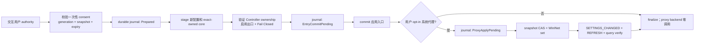

# Issue #12：可配置统一入口与用户代理安全切换

> 状态：安全事务、WinINet 适配器和禁用态 UI 已实现；真实执行入口仍关闭，等待隔离 Windows 用户环境验收。本阶段是 partial foundation，不能关闭 Issue #12。

## 已确认边界

| 项目 | 结论 |
|---|---|
| 入口 | 默认 `127.0.0.1:3666`，用户可以选择任意合法 loopback 端口；`6666` 只是一个可能的用户配置 |
| 普通设置保存 | 只更新应用配置，绝不调用系统代理 backend |
| 端口冲突 | 只有 `Free` 或与当前 generation 匹配的 exact-owned core 可继续；unknown/third-party 一律拒绝且不终止 |
| 系统代理 | 仅用户明确 opt-in；LocalService helper 永远不读写交互用户代理 |
| 网络范围 | 当前真实适配器只表达 default LAN/current interactive user；service、RAS/VPN、命名连接、多连接均 fail closed |
| 非目标 | 不启用 TUN，不修改路由/DNS/防火墙，不操作第三方客户端，不承诺长连接无缝迁移 |

## 事务顺序

每个具有外部 effect 的步骤都先持久化 intent。若 effect 已发生但后续 journal、广播或 verify 失败，恢复逻辑根据实际观察值处理：

- 当前代理仍等于本应用写入值：CAS 恢复完整原始快照，再 query verify；
- 当前代理等于原始快照：视为 effect 尚未发生；
- 当前代理是第三种值：视为用户或其他软件并发修改，拒绝覆盖并保留可重试 journal；
- entry 只恢复到事务记录的原入口，staged core 只按 PID + creation identity + fencing epoch + generation 精确停止。

consent 的 plan fingerprint 会在第一次 apply 尝试前写入有界的 durable consumed store；无论成功还是回滚，同一 consent 都不能再次使用。

## 完整代理快照

`SystemProxySnapshot` 分别保存并指纹绑定：

| 字段 | 保留语义 |
|---|---|
| direct flag | 与 manual/PAC/auto-detect 独立保留 |
| manual proxy server | `None` 与空字符串不混同；启用时必须非空 |
| proxy bypass/override | `None`、空字符串和原始字符串分别保留 |
| PAC URL | 未配置与非空 URL 分别保留 |
| auto-detect | 独立布尔值 |
| connection name | 当前只允许 `None`，即 default LAN；其他值 unsupported |

完整值只存在于 installer 收敛权限后的 durable journal 和 WinINet 调用边界；`Debug`、日志、状态和 UI 只暴露是否配置及指纹，不返回原代理服务器、PAC URL 或 bypass 内容。

## Windows API 选择

实现只使用 WinINet `INTERNET_PER_CONN_OPTION_LISTW`：查询使用 `INTERNET_PER_CONN_FLAGS_UI`，恢复/设置使用 `INTERNET_PER_CONN_FLAGS`，并在写入后调用 `INTERNET_OPTION_SETTINGS_CHANGED` 与 `INTERNET_OPTION_REFRESH`，最后重新查询做精确验证。所有 WinINet 分配的字符串均由 `GlobalFree` 释放。

依据：

- [INTERNET_PER_CONN_OPTION](https://learn.microsoft.com/en-us/windows/win32/api/wininet/ns-wininet-internet_per_conn_optionw)：manual server、bypass、PAC、auto-detect 和 FLAGS_UI/FLAGS 的官方语义。
- [WinINet option flags](https://learn.microsoft.com/en-us/windows/win32/wininet/option-flags)：刷新全局代理设置需要 `INTERNET_OPTION_REFRESH`，并可通知设置变化。
- [WinHttpGetIEProxyConfigForCurrentUser](https://learn.microsoft.com/en-us/windows/win32/api/winhttp/nf-winhttp-winhttpgetieproxyconfigforcurrentuser)：服务若不模拟登录用户会读取服务账户设置，因此 helper 不能承担用户代理 authority。
- [ProxyCfg/WinHTTP distinction](https://learn.microsoft.com/en-us/windows/win32/winhttp/proxycfg-exe--a-proxy-configuration-tool)：WinHTTP 默认代理不等于控制面板/IE 的用户代理；本项目不使用 `netsh winhttp` 或注册表写入冒充系统代理。

## 当前真实 blocker

生产 adapter 已编译，但 UI 执行按钮保持 disabled，且没有 Tauri command 可调用它。开放前仍需在一次性 Windows 测试用户/虚拟机完成：

1. 可靠证明当前进程是目标交互用户，并生成不可伪造的 user-scope identity；
2. 分类并拒绝 RAS、VPN、命名连接和多活动连接；
3. 用随机隔离 loopback 端口完成真实 ownership、Controller、出口、Fail Closed 验收；
4. 覆盖 PAC、manual、auto-detect、空 bypass、广播失败、进程崩溃、重启和并发人工修改；
5. 验证安装、升级、卸载必须先由交互用户恢复未决 journal，LocalService 不越权接管。

当前仓库只提供 `#[ignore]` 的隔离 live scaffold；默认测试不会触碰端口、系统代理或网络栈。
