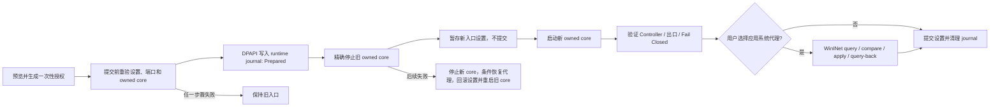

# Issue #12：可配置统一入口与用户代理安全切换

> 状态：桌面端后端命令、崩溃恢复和 UI 已接通；自动化测试只使用随机 loopback 端口或内存适配器，尚未执行占用真实 `127.0.0.1:6666` 的最终人工验收。

## 已确认边界

| 项目 | 当前实现 |
|---|---|
| 入口 | 默认 `127.0.0.1:3666`；目标必须是合法 loopback 地址和端口 |
| 普通设置保存 | 入口字段仍只读；检测到入口变化会拒绝，并要求进入独立的“安全入口切换”流程 |
| 授权 | 预览成功后生成 120 秒、一次性、仅存内存的授权；精确绑定当前入口、目标入口、是否应用系统代理以及设置指纹 |
| 端口冲突 | 预览先做 TCP 快照；提交前再次检查。目标端口只要可连接就拒绝继续，不区分所有者，也绝不终止或接管进程 |
| Core 验证 | 新入口必须通过进程所有权、Controller、全部已启用出口和 Fail Closed 验证后才能提交 |
| 系统代理 | 只在用户明确 opt-in 时，由当前活动交互用户操作 default-LAN WinINet；RAS/VPN、非活动控制台或无法证明作用域时 fail closed |
| Helper / Service | 当前只允许 desktop-owned 模式；Helper 权限模式明确拒绝，LocalService 不读写用户代理 |
| 非目标 | 不启用 TUN，不修改路由、DNS、防火墙，不操作第三方客户端，不承诺长连接无缝迁移 |

## 事务顺序

该顺序有意选择安全回滚而不是无缝切换。停止旧 core 到新 core 验证完成之间会有短暂 Fail Closed 中断；它避免两个 Mihomo 实例同时争用同一运行目录和受管配置。

## 恢复状态与机密边界

| 资产 | 处理方式 |
|---|---|
| 一次性授权 | 后端只在内存中保存授权记录；UI 通过 IPC 获得 opaque token 并原样回传。token 使用后立即消费，120 秒到期，且设置指纹变化即失效 |
| Runtime journal | 完整 JSON 使用当前用户 DPAPI 加密后，再以 main/backup 耐久写入受保护的 runtime 目录 |
| 代理快照 | manual proxy、PAC、bypass 等原值只存在于 DPAPI 密文中，不进入 UI、日志或审计 DTO |
| Settings journal | 复用现有原子设置事务；新 core 验证完成前只保留候选配置，不更新已提交 generation |
| 启动恢复 | 若设置已回滚，只在当前代理仍等于本事务写入值时恢复原快照；若观察到第三方新值，拒绝覆盖，并在确认应用配置已安全回滚后清理事务日志 |
| 已提交恢复 | 若设置已经提交，则要求代理状态与 journal 一致；矛盾或不可能的 phase/state 组合保持 Fail Closed |

## WinINet 并发限制

Windows 的 WinINet API 没有原子 compare-and-set。本实现采用受限的 `query -> compare -> apply -> broadcast -> query-back`：

1. 写入前当前快照必须与预览/事务保存的原快照完全一致；
2. 写入后必须精确读回目标快照；
3. 回滚时只有当前值仍等于本事务写入值才恢复原值；
4. 写入前重新验证活动控制台、进程 token SID 与 RAS/VPN 范围；如果期间出现第三方值，绝不覆盖它。

这不能消除 query 与 apply 之间的理论竞争窗口，但把可造成的破坏限制为“发现不一致就停止”，并防止回滚覆盖用户或其他客户端的后续修改。

## 验收状态

| 检查 | 状态 |
|---|---|
| 前端模型与生产构建 | 已通过 |
| Rust desktop 单元测试 | 已通过（包括一次性授权和 DPAPI journal 恢复） |
| workspace 格式、Clippy、全量测试 | 已通过 |
| 随机隔离端口 ownership / 启动验收 | 已通过；未知进程竞态不会被终止，`localhost` ownership 可验证 |
| 真实 `6666 -> 目标端口 -> 6666` 往返 | 未执行；必须先让第三方客户端退出 `6666`，并由用户现场确认 |

自动化测试不得读取或修改真实系统代理，也不得触碰用户正在使用的 `6666`。最终人工验收应先将当前本地代理客户端移到 `26666`，再从 VPN Hub 的“安全入口切换”执行，并在每一步核对 Controller、全部出口、Fail Closed 和系统代理读回值。
