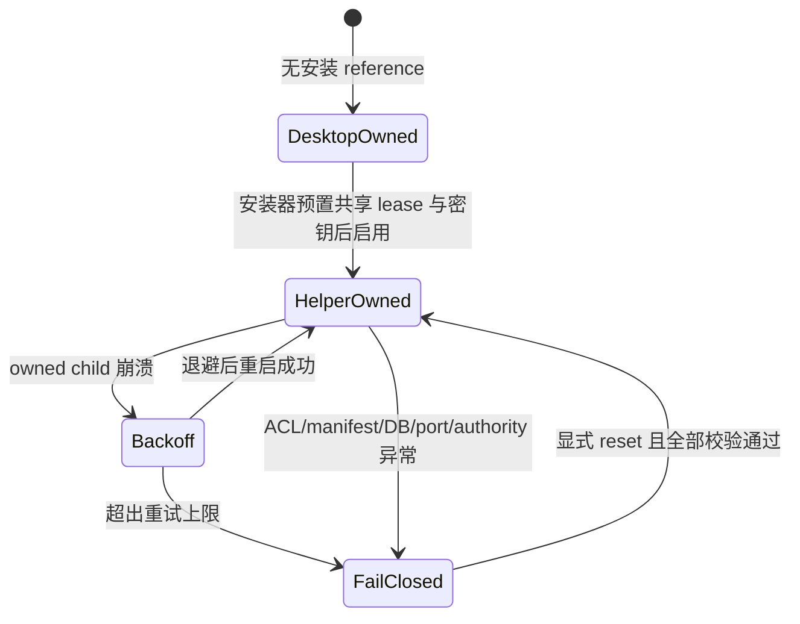

# Issue #13：最小权限 Windows Helper

## 交付边界

本 Issue 交付可运行的 `vpn-hub-helper`、Windows Service dispatcher、受保护 named pipe、Job Object 核心监督、桌面端 authority 路由和 Fail Closed 恢复逻辑。Helper 默认关闭，不自提权，也不自行注册、启动、升级或卸载 Service。

Issue #15 只负责签名安装器执行：创建受保护的 ProgramData 安装树、预置 `authority.lease`、分别写入 Service/客户端密钥材料、注册 LocalService、升级回滚及卸载清理。本 Issue 的 `InstallPlan` 仅生成 dry-run 数据，不调用 SCM 或提权 API。

| 边界 | 本 Issue | Issue #15 |
|---|---|---|
| Helper 运行时 | Service dispatcher、IPC、监督与恢复 | 签名部署与注册 |
| Service 身份 | 固定要求 `NT AUTHORITY\LOCAL SERVICE` | 安装时创建并验证 |
| ProgramData | 启动时实检 root、owner、DACL、reparse 与最终句柄路径 | 创建并应用 ACL |
| 进程 | 仅持有的 Child + Job Object；PID、创建时间、hash、fencing 全匹配 | 安装/升级前后清理验收 |
| Desktop | 无 reference 时 desktop-owned；配置 helper 后只走 authenticated pipe | 写入 installation reference 与客户端 protected-store 密钥 |

## 安全模型

| 风险 | 控制 | 失败语义 |
|---|---|---|
| 未认证或恶意本地连接 | pipe 仅允许目标用户、LocalService、SYSTEM，拒绝远程；challenge + HMAC-SHA256 + TTL + nonce + replay/rate limit | 丢弃当前连接，Service 继续接受后续合法请求 |
| 帧/解析资源耗尽 | 64 KiB 帧、固定 JSON 深度/字段长度/命令集合、5 秒 I/O 超时 | 脱敏拒绝 |
| 路径替换或权限提升 | 不跟随 reparse；最终句柄路径必须留在安装 root；逐 ACE 校验 trustee 与 mask；helper/core/key/元数据不可由交互用户写入 | 启动前 Fail Closed |
| Service 密钥泄漏 | `helper.key` 仅 LocalService/SYSTEM（可选 Administrators）；客户端使用独立 Windows protected-store reference | 任一用户 ACE 或陌生 trustee 均拒绝 |
| 杀错第三方进程 | 不按名称、端口或 PID 扫描；只操作自己创建并持有的 child/job handle | identity 不一致则拒绝 |
| 双重监督 | Desktop 与 Helper 共用预置 `authority.lease`，文件锁加 fencing token | 第二 authority Fail Closed |
| 配置/数据库/端口异常 | 每次 start/reload 重新验证 manifest 与 SQLite `quick_check`；启动前短暂 bind 用户配置的动态入口 | 返回 `corrupt-config`、`corrupt-database` 或 `port-conflict` |
| 崩溃循环 | 1/2/4/8 秒退避、稳定运行窗口、最大重试与 circuit breaker | 不无限重启，只能显式 reset |
| 睡眠、登录或网络变化 | SCM PowerEvent/SessionChange；真实 IPv4+IPv6 adapter 指纹，仅在变化时恢复 | 枚举瞬时错误保持旧指纹，不伪造变化 |
| 订阅凭据泄漏 | status 只含 entry、generation、outlet id/kind/health；支持多个 subscription outlet | 不返回 URL、节点、token、目标或 controller secret |

## Authority 流程



## 动态监督 manifest

manifest 只允许固定 schema：

```text
install_id + generation
fixed bin/mihomo.exe + sha256
fixed runtime/mihomo.yaml
fixed data/guardian.db
entry(host, user-configured port)
outlets[(stable outlet_id, subscription|local-proxy, health)]
```

Helper 不解析或回传 runtime YAML、SQLite 内容、订阅地址、节点或 token。入口端口没有固定值；开发默认端口、用户入口以及多个订阅出口都由上层配置生成 manifest。

## 未在开发机执行的操作

本实现没有注册、启动、停止或卸载任何 Windows Service，没有修改系统代理、注册表、防火墙或 TUN，也没有探测、绑定、切换或终止现有 6666/3666 端口及第三方 VPN 进程。真实 I/O 测试仅使用随机 named pipe、临时目录、临时 SQLite 和操作系统分配的临时 TCP 端口。
