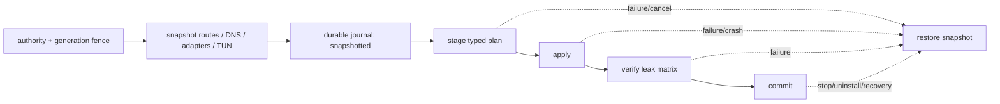

# Issue #14：动态出口下的可选 TUN、DNS 接管与防递归回滚

## 当前结论

截至 2026-07-20，TUN 的计划、状态机、事务 journal、fake Windows backend 与桌面安全预览已经实现；生产 Windows adapter 只校验 typed plan，并明确返回 `windows_verified_application_identity_exclusion_unavailable`。当前开发机未创建 TUN、未修改路由/DNS/适配器/防火墙/WFP/注册表/系统代理，也未运行 Mihomo 或 Windows Service。

这不是“功能已真实接管系统”。它是一道刻意的安全门：只有独立隔离环境中的 Windows backend 能证明按应用身份排除、全协议防泄漏和可靠恢复后，才能把 `supported` 改为 true。

## 官方能力核对

访问日期均为 2026-07-20。

| 来源 | 已确认能力 | 对本项目的约束 |
|---|---|---|
| [Mihomo TUN 配置](https://wiki.metacubex.one/en/config/inbound/tun/) | `auto-route` 可配置全局路由；Windows `strict-route` 会添加规则以抑制多宿主 DNS 泄漏；Windows/MacOS 不能自动劫持发往 LAN 的 DNS；UID 排除仅 Linux，package 排除仅 Android | 官方字段没有 Windows 按进程排除，不能把 `PROCESS-NAME` 当作安全身份；DNS 必须覆盖 TCP/UDP、IPv4/IPv6 并独立验收 |
| [Microsoft Application Layer Enforcement](https://learn.microsoft.com/en-us/windows/win32/fwp/application-layer-enforcement--ale-) | ALE 是可依据 normalized application identity 与用户身份分类连接的 WFP 层 | 它能提供身份分类，但普通 permit/block 不会自动改变 TUN 路由；真实 backend 还需可审计的 packet-routing/TUN bypass executor |
| [Microsoft Windows Filtering Platform API](https://learn.microsoft.com/en-us/windows/win32/api/_fwp/) | 官方 API 提供 `FwpmGetAppIdFromFileName0` 和 IPv4/IPv6 ALE connect layers | 未来 adapter 必须把 typed identity filter 与路由执行协同，并使用最小 provider/sublayer/filter 权限和可恢复事务；不得拼接 shell 命令 |

## 产品行为

| 条件 | 行为 |
|---|---|
| 默认安装/升级 | TUN 关闭；不弹 UAC、不改系统网络 |
| 首次请求启用 | 必须确认当前版本风险；能力 unsupported 时确认控件禁用，且不会记录为已启用或已同意 |
| 普通统一入口模式 | 与 TUN 计划相互独立；TUN 失败会恢复切换前 snapshot，不影响普通模式配置 |
| 多个订阅出口 | 每个保留稳定 outlet ID；凭据、订阅 URL、节点和 Controller secret 不进入 TUN plan/journal/status |
| 多个本地出口 | 每个必须有稳定 outlet ID、明确 loopback endpoint、用户登记的本地绝对 executable path 和 SHA-256 |
| 动态增删 outlet | settings preview generation 随草稿指纹变化；计划只包含当前启用且登记的 outlet，不残留已删除身份 |
| all-down | IPv4/IPv6 × TCP/UDP/DNS 全部 `Rejected`，不生成或回退 `DIRECT` |

## 进程身份与 disposition

“排除清单”不是“这些进程可以任意直连”。计划把身份与网络 disposition 分离：

| 角色 | disposition |
|---|---|
| GUI / Helper | `ControlPlaneDenyEgress`：外网拒绝，只允许必要 loopback IPC |
| VPN Hub-owned Core | `OwnedCoreUpstreamOnly`：仅计划内上游 transport |
| 登记的 local client | `RegisteredOutletInfrastructureBypass`：以 normalized app identity 精确匹配的最小基础设施 bypass |
| 未知进程 | 不扫描、不匹配、不停止、不修改 |

路径和 SHA-256 都必须匹配；UNC、相对路径、父目录跳转、非 `.exe`、非小写 64 位 SHA-256 均拒绝。真实 adapter 还必须在打开文件句柄后核对 final path、reparse point、签名/ACL 与 TOCTOU，不能仅相信字符串。

## 协议矩阵与 Issue #11 对齐

计划对 IPv4/IPv6 各生成 Application TCP、Application UDP、DNS TCP、DNS UDP 四个验证向量：

- 有健康 TCP 出口时 TCP 向量才可 `Tunneled`。
- 只有带当前有效 UDP 证据的健康出口才能让 UDP 向量 `Tunneled`。
- TCP-only、unknown 或 stale UDP 证据不会被猜测为 UDP 可用。
- all-down 或 backend capability 不完整时全部 `Rejected`。

## 事务与恢复

每个 OS 边界后先持久化 phase，再进入下一阶段。journal 使用同目录临时文件、文件和目录 durability barrier 与 Windows 可替换的备份策略；主文件损坏时可读相同的 `.bak`。第二 authority、stale generation 和未恢复的旧 journal 都被拒绝。恢复重复执行安全；只有恢复完成并持久化后才清理 journal。

journal 只允许长度受限的 opaque route/DNS/adapter/TUN record；单条、总大小、数量和 secret-shaped 内容都有上限。它不保存命令文本、订阅、节点、token、密码、Controller secret 或访问目标。

## 已自动化验证

- 默认关闭、当前版本风险确认、生产 unsupported Fail Closed。
- 多 subscription / 多 local_proxy、动态删除/新增、stable ID 和 exact identity。
- GUI/Helper deny、Core 最小上游、local client 精确基础设施 bypass、unknown process no-touch。
- TCP-only 与 UDP evidence 分离；all-down 全矩阵 Reject；序列化无 `DIRECT`。
- snapshot/stage/apply/verify/commit 每个 OS 失败点与每个 journal save 失败点回滚。
- crash/cancel/restart/uninstall 恢复幂等；stale generation 与第二 authority 拒绝。
- 真实 `FileTunJournalStore` 连续多 phase save/load/backup/clear（仅文件系统，不执行网络系统调用）。

## 真实 Windows destructive acceptance 剩余 gate

以下测试只能在可恢复的隔离 Windows VM/物理测试机执行，当前仓库测试不得运行：

1. 签名 installer 安装最小权限 WFP/ALE identity provider/filter、可审计的 packet-routing/TUN bypass executor 与 TUN adapter；证明 permit/block 之外的真实绕过语义，并验证 ACL、升级和卸载。
2. 对 GUI/Core/Helper/多个登记 local client 的 normalized app identity 做正反例与二进制替换/重解析攻击测试。
3. IPv4/IPv6、TCP/UDP、DNS TCP/UDP、LAN DNS、Wi-Fi 切换、睡眠、登录和网络变化矩阵。
4. 在每个 apply 边界强杀进程/断电，重启后验证 route/DNS/adapter/TUN 恢复到 snapshot。
5. all-down、单个 TCP-only outlet、全部 UDP evidence stale 时确认没有真实 IP/DNS 直连。
6. 卸载后确认无 WFP filter、路由、DNS、虚拟网卡、Service、owned process 或 journal 残留。

在这些 gate 全部通过前，生产状态必须持续为 `unsupported`。
