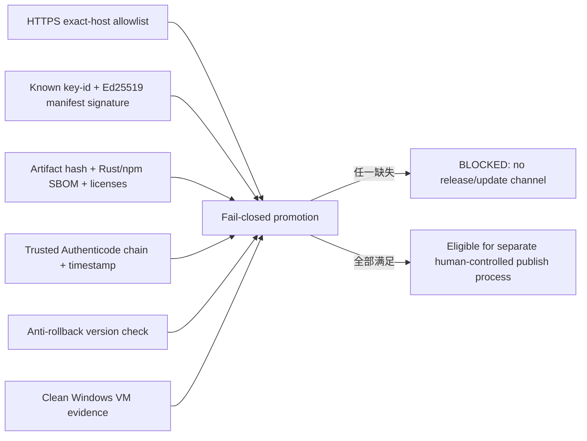

# Issue #15：Windows 发布与升级安全前置

本交付是 **partial foundation**，不代表 VPN Hub 已可正式发布。它不会签名、安装、运行或上传发行包，也不会读取证书、私钥、订阅、Controller secret，且不会操作系统代理、TUN、DNS、路由、防火墙、注册表、Service、第三方客户端或 `6666/3666` 端口。

## 当前边界

| 能力 | 当前状态 | 正式发布门槛 |
| --- | --- | --- |
| Windows NSIS | 可构建并重命名为 `.dev.nsis-setup.exe` | 受信 Authenticode 证书、SHA-256、RFC3161 时间戳和 `signtool verify /pa /tw` |
| 更新清单 | typed canonical JSON、Ed25519 验证、key-id、anti-rollback | 审核后的生产公钥和 HTTPS 更新域名；生产默认 trust root 为空，因此 updater disabled |
| 更新源 | 精确域名 allowlist，只接受 HTTPS | 域名/托管所有权、TLS 运维和事故撤回流程 |
| SBOM | Rust 与 npm 各一份 CycloneDX 1.6 JSON | 每次候选构建校验、留档并随发行材料发布 |
| 许可证 | Rust/npm 组件清单；缺失声明标为 `NOASSERTION` | 人工完成 `NOASSERTION` 和再分发义务审查 |
| 可复现性 | 连续两次构建比较规范化依赖、许可证、toolchain 与 artifact hash | NSIS/PE 字节差异必须留报告；签名与时间戳不纳入 unsigned dev 的字节等价承诺 |
| System proxy | 不包含 Issue #12 executor | 首版只有明确纳入该功能时才追加 #12 的隔离验收 |
| TUN | production executor 明确 unsupported，release feature 强制 disabled | Issue #14 的真实 Windows executor 独立评审与隔离验收 |

依据：GitHub 只把 full-length commit SHA 视为不可变 Action 引用；Tauri 在 Windows 上用 `tauri build` 生成 NSIS；Microsoft 要求 SignTool 明确 SHA-256 digest，并以 Authenticode policy 验证；CycloneDX 规范允许 `*.cdx.json`。参见 [GitHub secure use](https://docs.github.com/en/actions/reference/security/secure-use)、[Tauri Windows installer](https://v2.tauri.app/distribute/windows-installer/)、[Microsoft SignTool](https://learn.microsoft.com/en-us/windows/win32/seccrypto/signtool)、[CycloneDX specification](https://cyclonedx.org/specification/overview/)。

## 产物与可比较范围

`.github/workflows/windows-release-foundation.yml` 锁定 Node `24.15.0`、npm `11.12.1`、Rust `1.97.0`、Tauri CLI `2.11.4`，第三方 Actions 使用 full SHA。PR 运行完整验证但不上传；普通手动 dev run 只保留 7 天 Actions evidence；tag 或明确 promotion 请求会进入 fail-closed gate，不会创建 tag、GitHub Release 或更新 channel。

| 文件 | 作用 | 是否可 promotion |
| --- | --- | --- |
| `*.dev.nsis-setup.exe` | 未签名开发安装器，仅用于 isolated VM | 否 |
| `SHA256SUMS` | dev artifact SHA-256 | 单独不足 |
| `rust-sbom.cdx.json` | Cargo dependency coverage | 单独不足 |
| `frontend-sbom.cdx.json` | npm dependency coverage | 单独不足 |
| `licenses.json` | 许可证表达式清单 | 单独不足 |
| `reproducibility.json` | 规范化、可比与排除范围 | 单独不足 |
| `release-manifest.dev.json` | version/commit/toolchain/hashes 绑定；无签名、无更新 URL | 否 |
| `reproducibility-diff.json` | 两次构建的材料/installer hash 差异 | 单独不足 |

规范化材料不记录 wall-clock time、绝对路径、用户名、runner 名或随机 SBOM serial number。installer 的两个 SHA 会原样报告，绝不把不同二进制“归一化成相同”。

## 更新验证与 promotion gate

production `ReleasePolicy::disabled()` 没有任何占位公钥；未知 key、清单字段篡改、HTTP、未知域名、同版本/降级、artifact hash 或 size 不匹配均拒绝。测试密钥只存在于 `#[cfg(test)]`，是固定 fixture，不属于生产 binary。

## 安装、升级和卸载 contract

| 场景 | 顺序 | 数据结果 |
| --- | --- | --- |
| Fresh install | 验证 helper plan → 断言不含 system proxy/TUN executor → snapshot → 逐项迁移 → schema/orphan 验证 | 初始化 EntryConfig、OutletConfig、Secret Store、SQLite、Helper、TUN journal contract |
| Upgrade | `EnterFailClosed → StopOwnedJob → RestoreTunSnapshot` → snapshot → helper replacement plan → 逐项迁移 → verify | 失败只回滚本次已完成、由 VPN Hub 拥有的变更；保持 fail-closed/stopped，不恢复为不安全运行态 |
| Uninstall preserve | 同一安全前缀 → snapshot/preserve user data → helper cleanup → no-orphan verify | 保留 EntryConfig、OutletConfig、Secret Store 与 SQLite；移除 owned Helper/TUN journal |
| Uninstall delete | 同一安全前缀 → 删除 VPN Hub owned data → helper cleanup → no-orphan verify | 删除应用拥有的数据，不扫描或删除第三方进程/客户端/配置 |

这些只由 planner、fake backend 和 temp directory 验收；当前 PR 不执行真实安装、升级、卸载或系统操作。

## 发布清单

正式候选必须全部满足，否则 promotion script 返回失败：

- [ ] commit、Cargo/Tauri/frontend version 一致，依赖与 tools 使用锁定版本。
- [ ] 两次构建的 normalized materials 相同，NSIS hash 差异已审阅。
- [ ] artifact 与 manifest 的 SHA-256、size 完全一致。
- [ ] Rust/npm SBOM 与许可证清单存在且已审阅。
- [ ] installer/binaries 具有受信 Authenticode chain 与 RFC3161 timestamp，SignTool 无 warning。
- [ ] canonical update manifest 由受信 key-id 签名，生产 binary 内置审核后的公钥。
- [ ] update URL 是 owned HTTPS host 且在 exact allowlist；撤回/轮换/runbook 已演练。
- [ ] downgrade、unknown key、tamper、HTTP、unknown host、hash mismatch 全部拒绝。
- [ ] clean Windows VM 的 fresh/upgrade/crash/uninstall matrix 全绿。
- [ ] sensitive scan 不含 PFX/PEM/private key、订阅/token/Controller secret。
- [ ] TUN executor 仍 unsupported 时 release feature 保持 disabled。
- [ ] 若正式版本明确纳入 system proxy，再追加 Issue #12 隔离验收；本 foundation 不含。

## Rollback / runbook

1. **发现候选异常**：停止 promotion，不生成 release/tag，不写 update channel。
2. **下载或 manifest 验证失败**：保留当前已安装版本；不得运行候选 installer。
3. **升级开始后失败**：保持 fail-closed、停止 owned job、恢复 outstanding TUN snapshot，只回滚当前事务的 owned changes。
4. **签名或托管泄露**：从 allowlist/update manifest 撤回 key-id，轮换 update signing key；Authenticode 证书按 CA 流程撤销。旧版本在新 trust root 发布前保持 updater disabled。
5. **需要恢复旧功能**：发布更高 semver 的修复版本；禁止通过 lowering version 绕过 anti-rollback。
6. **发现 orphan**：阻断候选，记录 owned install-id/job/service reference；不得按进程名扫描或终止第三方客户端。

## Clean Windows VM 验收矩阵（当前未执行）

| Case | 隔离条件 | 预期证据 | 当前 |
| --- | --- | --- | --- |
| Fresh install | 新 VM、无用户数据 | installer chain、schema、无 orphan | BLOCKED |
| Upgrade | 上一正式版本 + 多订阅/动态出口/EntryConfig/SQLite/Secret Store | 数据迁移、helper ownership、TUN disabled | BLOCKED |
| Downgrade | 当前版本高于候选 | updater 拒绝且不运行 installer | 自动化 fixture 已过；真实 VM BLOCKED |
| Partial failure | 每个迁移边界注入失败 | only-owned rollback、保持 fail-closed | fake 已过；真实 VM BLOCKED |
| Uninstall preserve/delete | 两种选项分别执行 | 保留或删除精确数据集、无 Service/job/TUN orphan | fake 已过；真实 VM BLOCKED |
| Crash/restart | upgrade/restore 中断 | journal recovery 幂等 | 继承 #13/#14 fake contract；真实 VM BLOCKED |

## 外部输入与阻断项

| 阻断项 | 需要的输入/环境 |
| --- | --- |
| Authenticode | 所有者确认的受信代码签名证书、HSM/secret-store 接入、RFC3161 服务、证书轮换/撤销负责人 |
| Update signature | 离线/受控更新私钥托管、审核后的生产公钥与 key-id rotation policy |
| Update hosting | 所有者控制的 HTTPS 域名、allowlist、可用性与撤回方案 |
| Windows acceptance | 至少一台不承载当前 VPN 的 clean Windows VM，允许真实 install/upgrade/uninstall/reboot |
| TUN | #14 Windows packet-routing/WFP executor 与独立安全验收 |

因此 Issue #15 必须保持 open/blocked；本 PR 只能证明安全前置，不满足“签名有效”和“至少一套干净 Windows 环境验收”两个完成条件。
