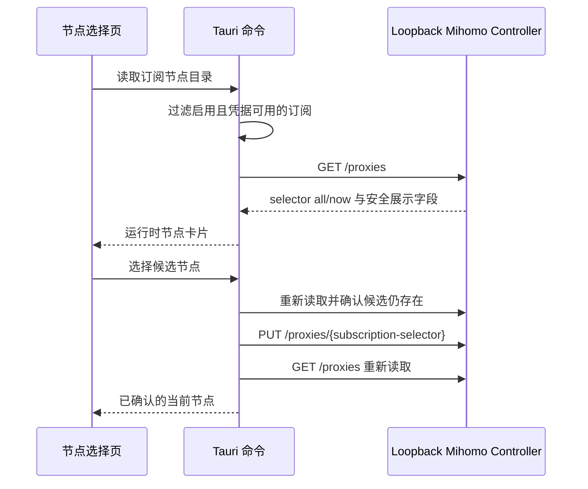

# Issue #29：订阅节点选择

## 目标与边界

| 项目 | 约束 |
|---|---|
| 数据来源 | 主核心运行时读取其带随机 secret 的 loopback Controller；主核心关闭时回退到随机端口、loopback-only、默认 REJECT 的隔离探测运行时 |
| 可管理对象 | 已启用且凭据状态为 `configured` 的 `subscription` 出口 |
| 展示字段 | 节点名称、代理类型、健康状态、Mihomo 已知的最近延迟 |
| 明确排除 | server、port、UUID、密码、token、订阅 URL、第三方客户端内部节点 |
| 持久化 | VPN Hub 不保存节点名称或列表；Mihomo 以 `store-selected` 保存 `url-test` 组的 fixed 节点 |
| 失败行为 | PUT 前失败不会修改选择；PUT 已发送后若无法权威回读，只报告“结果未确认”并要求刷新，不对实际节点作错误承诺 |

## 运行流程



节点选择使用由 `outlet_proxy_name(subscription_id)` 派生的订阅 selector。提交前必须再次确认节点仍在该 selector 的 `all` 集合中；提交后必须以 Controller 返回的 `now` 为准，前端不做乐观成功。

## 手动选择的存活期

订阅出口当前是 Mihomo `url-test` 组。手动选择会设置该组的 fixed 节点，并由 `store-selected` 在 selector 名称稳定时跨重载保存。只要该节点仍存在且健康，`url-test` 会优先使用它；节点不健康时，Mihomo 可以临时改用其他健康节点，恢复健康后再回到 fixed 节点。用户再次选择、取消 fixed 状态、节点从 provider 消失或 selector 被替换时，这个选择不再生效。

当前 Guardian 和路由模式只切换外层 `MASTER_SELECTOR`/`UDP_SELECTOR`，不会改写订阅内部的 fixed 节点。未来如果新增会操作订阅内部 selector 的自动策略，必须在同一事务锁下定义清晰的优先级，并在 UI 中显式提示，不能静默覆盖手动选择。

## 状态模型

| 状态 | UI 行为 |
|---|---|
| `available` | 展示节点、搜索并允许选择 |
| `core_unavailable` | 主核心与隔离探测运行时都不可用时，提示检查 Mihomo 文件与订阅配置；不探测其他进程 |
| `controller_error` | 主核心存在但 Controller 查询失败时，提示检查主核心状态；不误导为隔离运行时启动失败 |
| `provider_unavailable` | 提示等待 provider；原选择保持不变 |
| 无可管理订阅 | 引导到设置页启用订阅并保存凭据 |

浏览器预览只使用合成节点名称，用于布局与交互验收；不会启动 Mihomo、绑定入口或修改 Windows 系统网络。

## 验证

```powershell
cargo test -p vpn-hub-core controller --lib
cargo test -p vpn-hub-desktop --lib
cd apps/desktop
npm test
npm run build
```

真实订阅验收只能在用户明确授权的隔离环境中进行，且不得把节点名称、订阅 URL、Controller secret 或运行日志复制到 Issue、PR 或测试证据。

主核心关闭时，节点目录不会暴露隔离运行时自动选择的成员为“当前节点”，
也不会允许提交真实节点切换；必须启动主核心并重新读取权威 selector 后才能选择。
