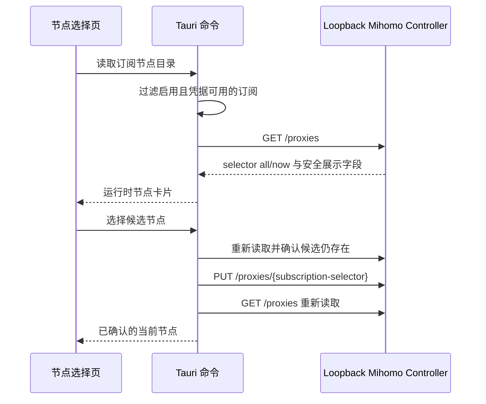

# Issue #29：订阅节点选择

## 目标与边界

| 项目 | 约束 |
|---|---|
| 数据来源 | 仅本应用自管、带随机 secret 的 loopback Mihomo Controller |
| 可管理对象 | 已启用且凭据状态为 `configured` 的 `subscription` 出口 |
| 展示字段 | 节点名称、代理类型、健康状态、Mihomo 已知的最近延迟 |
| 明确排除 | server、port、UUID、密码、token、订阅 URL、第三方客户端内部节点 |
| 持久化 | VPN Hub 不保存节点名称或列表；当前选择由 Mihomo `store-selected` 管理 |
| 失败行为 | Controller/provider/节点不可用时保留原选择，不产生 `DIRECT` 回退 |

## 运行流程



节点选择使用由 `outlet_proxy_name(subscription_id)` 派生的订阅 selector。提交前必须再次确认节点仍在该 selector 的 `all` 集合中；提交后必须以 Controller 返回的 `now` 为准，前端不做乐观成功。

## 状态模型

| 状态 | UI 行为 |
|---|---|
| `available` | 展示节点、搜索并允许选择 |
| `core_unavailable` | 提示启动本应用自管核心；不探测其他进程 |
| `provider_unavailable` | 提示等待 provider；原选择保持不变 |
| 无可管理订阅 | 引导到设置页启用订阅并保存凭据 |

浏览器预览只使用合成节点名称，用于布局与交互验收；不会启动 Mihomo、绑定入口或修改 Windows 系统网络。

## 验证

```powershell
cargo test -p vpn-hub-core controller --lib
cargo test -p vpn-hub-desktop --lib
cd apps/desktop
npm test
npm run build
```

真实订阅验收只能在用户明确授权的隔离环境中进行，且不得把节点名称、订阅 URL、Controller secret 或运行日志复制到 Issue、PR 或测试证据。
