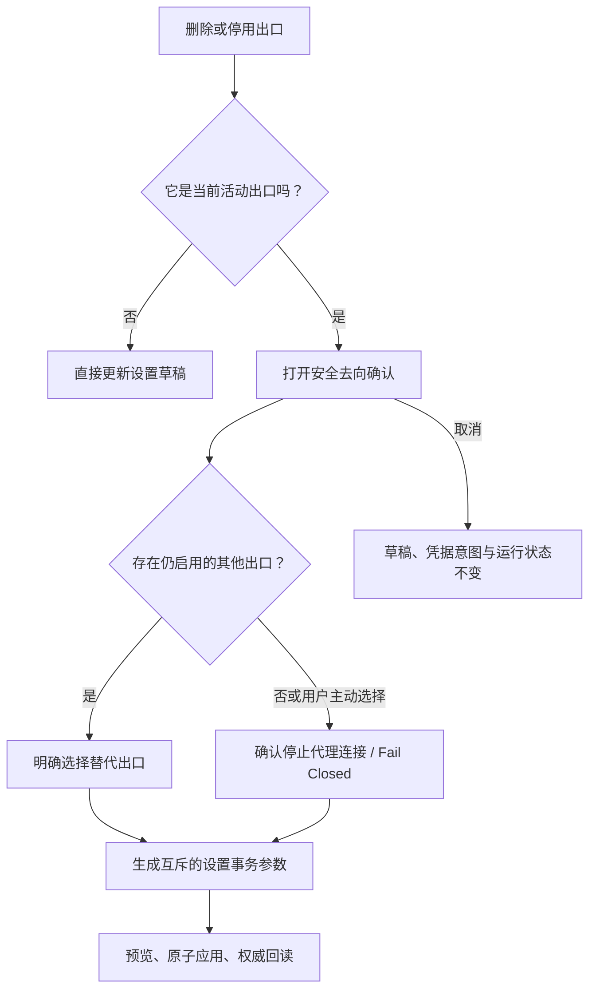

# Issue #43：聚焦多出口代理核心路径

## 产品结论

VPN Hub 当前定位为 Windows 本地多出口代理编排器，而不是已经接管全系统流量的 TUN VPN。桌面主路径只保留用户现在可以完成的任务：查看入口与出口状态、选择路由模式、管理出口、应用设置和查看历史。

| 原常驻模块 | 当前处理 | 保留的安全边界 |
|---|---|---|
| 订阅 UDP 端到端验证 | 从总览移除手动目标、授权和执行入口 | `supported / tcp_only / unknown` 证据、SQLite 历史、Mihomo UDP 选择器与 `REJECT` 不变 |
| 删除当前出口的安全选择 | 从全局设置卡片移入删除/停用活动出口的情境确认 | 后端继续要求唯一的替代出口或明确 Fail Closed，禁止 `DIRECT` |
| 可选 TUN（当前不可用） | 从设置页和普通 settings preview 契约移除 | `vpn-hub-helper` 的 typed plan、journal、fake backend 与生产 unsupported gate 不变 |

## 活动出口交互

确认界面使用一个 radio group 表达互斥结果，替代了“下拉框 + 独立复选框”。候选项只包含草稿中仍启用且不是当前活动出口的出口；删除和停用走同一门禁，不能通过关闭“启用”复选框绕过。

## UDP 产品边界

出口表继续展示当前 UDP 证据。订阅出口没有有效的受控端到端证据时保持 `unknown`；`tcp_only`、`unknown`、all-down 与手动 Fail Closed 都让 `VPN-HUB-UDP` 选择 `REJECT`。移除的是普通用户难以完成的外部 Echo 表单，不是底层防泄漏模型。

## TUN 产品边界

普通 settings preview 不再返回 `tun_plan`，设置页也不显示禁用开关或内部 reason code。Issue #14 的基础实现仍保留，但这不代表生产 Windows backend 可用。重新引入产品入口至少需要：真实应用身份排除、IPv4/IPv6 × TCP/UDP/DNS 防泄漏、崩溃/断电恢复与独立 Windows 隔离验收。

## 验证范围

- 前端模型测试覆盖候选出口过滤、替代出口与 Fail Closed 的互斥决策。
- 设置页静态回归覆盖删除和停用共用情境确认、取消焦点返回，以及 UDP/TUN 常驻控件消失。
- Rust 设置预览与动态故障测试继续证明后端拒绝含糊去向，并保持 UDP `REJECT` / 无 `DIRECT`。
- 浏览器预览只使用 mock 数据，不启动 Mihomo、不绑定入口端口，也不修改系统代理、TUN、DNS 或路由。
