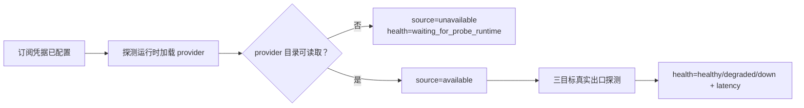

# Issue #45：启动即验证与按出口自适应探测

状态：Accepted
日期：2026-07-22

## 决策

VPN Hub 在桌面协调器启动时立即为所有启用且可验证的出口签发一次探测租约，不等待统一入口启动，也不等待 15、60 或 180 秒定时器。后续调度以稳定 `outlet_id` 隔离：

| 出口结果 | 基础间隔 | 行为 |
|---|---:|---|
| 当前活动且健康 | 15 秒 | 保持较快可见性 |
| 健康备用 | 60 秒 | 降低外部请求 |
| 可恢复失败 | `3, 3, 6, 12, 30, 60, 180` 秒 | 只加速失败出口，并加入 ±10% 确定性 jitter |
| 已成功但尚未达到恢复阈值 | 3 秒 | 保持快速确认，直至 SQLite 连续成功阈值确认恢复 |
| 未配置订阅 | 无定时器 | 凭据/配置事件唤醒 |
| 等待探测运行时 | 60 秒低频复核 | runtime、网络、恢复或配置事件立即唤醒 |
| terminal gate | 无定时器 | 显式恢复事件唤醒 |

每个出口同一时间至多有一个租约。租约携带 generation；取消或旧 generation 的完成消息不能更新当前调度状态。桌面协调器仍只保留一个 Guardian 工作任务，因此不会形成无界任务队列。

## 状态与证据边界

订阅源状态和真实出口健康是两个字段：

`source=available` 只证明订阅下载/解析后存在 provider 成员，不会提升出口健康。只有 Controller 对目标返回的真实延迟结果才进入 SQLite、防抖和选路。未配置、等待 runtime、源未就绪不写入伪造的 `down` 样本。

本地 loopback 黑盒代理不依赖统一入口：先做真实 TCP 连接，再由显式 HTTP/SOCKS 代理请求配置中的 HTTPS 目标。失败只暴露 `port_unreachable`、`port_timeout`、`proxy_connect_failed`、`request_timeout` 等固定可恢复码。

## 探测运行时 ownership 与 Fail Closed

当产品自管核心未运行时，配置过的订阅由独立 `OwnedProbeCore` 验证：

| 约束 | 实现 |
|---|---|
| 入口 | OS 随机分配的 loopback 端口，显式排除产品统一入口 |
| Controller | 独立随机 loopback 端口和 32 字节随机 secret |
| 默认路由 | `MASTER` 首项为 `REJECT`，无 `DIRECT` fallback |
| 网络副作用 | `allow-lan=false`；不配置 TUN/DNS，不修改 WinINet/WinHTTP、路由、适配器或防火墙 |
| 进程 | 只保存本次创建的 child；Drop/配置失效/APP 退出仅终止该 PID |
| 文件 | 配置位于 ACL 加固的临时目录，运行时销毁；URL 和 secret 不进入 SQLite、UI、事件或日志 |

产品自管核心运行时复用其已验证 Controller，但只探测调度器签发的 outlet 集合；路由决策仍从完整 SQLite 稳定状态计算，保留连续失败 2 次进入 `down`、连续成功 3 次恢复以及 Fail Closed。

## 并发、期限与请求上界

一个出口的三个目标并发执行，每目标沿用 `request_timeout_ms`，整组使用 `request_timeout_ms + 500ms` 全局 deadline。deadline 到达时取消余下任务并保留已完成结果。每个租约最多发出 `probe_targets.len()` 个请求；per-outlet 调度、失败退避和 jitter 避免全量 3 秒请求风暴。

## UI 通知

每批状态写入后，Tauri 发出 `guardian://updated`。事件仅包含 generation、稳定 outlet ID 和固定 reason code；React 收到后立即重读权威 dashboard。15 秒轮询保留为窗口重开或通知丢失时的恢复兜底。

## 回滚

回滚本变更会恢复旧的全局 `monitor.interval_seconds` 调度和 15 秒 UI 轮询。回滚不需要 SQLite 迁移：本变更未新增数据库表或列，既有历史、防抖和 Fail Closed 状态保持可读。回滚前应先退出 APP，以便 `OwnedProbeCore` RAII 清理随机端口和临时目录。

## 与 Issue #42 的边界

本实现基于 `main` 自包含一个只服务 Guardian 的租约 generation 和单任务取消边界，不复制 #42 的设置快速提交、热重载、锁拆分或 UI 主路径重构。#42 合并后若同时调整 `commands.rs`/`lifecycle.rs` 的任务模型，需在 rebase 时保留本 ADR 的 per-outlet 租约、结构性暂停和 stale-generation 拒绝契约。
