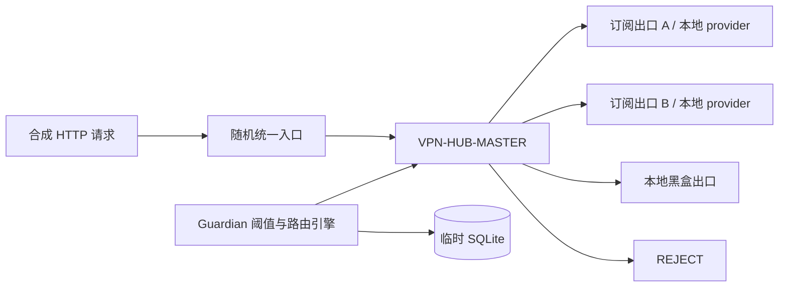

# Issue #5：动态多出口隔离故障验收

## 验收边界

专用 harness 只使用随机空闲 loopback 端口、临时数据目录、本地合成 provider 与项目锁定的 Mihomo `v1.19.28`。它不读取真实订阅，不连接或探测 `3666` / `6666`，不修改系统代理、防火墙、TUN、Service 或第三方客户端。



三个出口 transport 都是 harness 自己启动并持有 `Child` handle 的 Mihomo sidecar。sidecar 只允许访问 `fixture.invalid -> 127.0.0.1` 的合成目标，其他目标一律 `REJECT`；其中的 `DIRECT` 仅用于本地测试 transport，不存在于外层产品 runtime。外层生成配置会断言无 `DIRECT`，订阅组和主选择器都显式以 `REJECT` 兜底。

每次健康探测都会用外层真实 Controller 暂时把主选择器指向待测的稳定 `outlet_id`，再通过全新的入口连接访问合成目标；探测完毕后立即恢复路由引擎的最终选择。这样不会把 Mihomo 的 delay 历史缓存误当作出口仍然可用。

## 覆盖场景

| 场景 | 真实证据 |
| --- | --- |
| 随机端口与占用 | 所有 listener 由 `127.0.0.1:0` 分配并保持所有权；占用候选不会被复用 |
| 初始 Fail Closed | Controller 把主选择器设为 `REJECT` 后，新的入口请求失败 |
| 单订阅失败 | 终止 harness 自持的订阅 A transport；连续两次失败后切到订阅 B |
| 恢复迟滞 | 通过本地 provider 更新恢复订阅 A；三次成功前不恢复，冷却结束后才回切 |
| 多订阅不可用 | 订阅 A 与 B 都不可用后，只选择健康的本地黑盒出口 |
| all-down | 三个出口都不可用后，Controller 当前选择为 `REJECT`，新入口请求失败 |
| 历史与脱敏 | SQLite 仅包含稳定 `outlet_id`、白名单状态、原因和切换事件，不含 provider URL、节点名或 Controller secret |
| 清理 | 只对 harness 持有的 `Child` 执行 `kill + wait`；本地 HTTP fixture 使用 stop flag 与 thread join |

验收发现并固定了一个真实 Fail Closed 风险：订阅 `url-test` 组如果只有 `use` 且 `proxies` 为空，Mihomo 会注入 `COMPATIBLE`。现在每个订阅组显式包含 `REJECT`，provider 缺失或不可用时不会形成隐式通路。

## 执行

普通 `cargo test --workspace` 会编译 harness、执行端口/稳定 ID 测试，并明确跳过需要二进制的 runtime 场景。完整验收使用：

```powershell
.\scripts\run-isolated-fault-acceptance.ps1
```

成功输出只有白名单汇总，不打印端口、provider 内容、合成节点名或 Controller secret。
