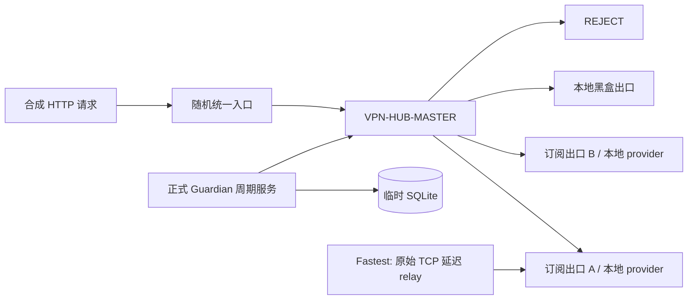

# Issue #5：动态多出口隔离故障验收

## 验收边界

专用 harness 只使用随机空闲 loopback 端口、临时数据目录、本地合成 provider 与项目锁定的 Mihomo `v1.19.28`。它不读取真实订阅，不连接或探测 `3666` / `6666`，不修改系统代理、防火墙、TUN、Service 或第三方客户端。



三个出口 transport 都是 harness 自己启动并持有 `Child` handle 的 Mihomo sidecar。sidecar 只允许访问 `fixture.invalid -> 127.0.0.1` 的合成目标，其他目标一律 `REJECT`；其中的 `DIRECT` 仅用于本地测试 transport，不存在于外层产品 runtime。外层生成配置会断言无 `DIRECT`，订阅组和主选择器都显式以 `REJECT` 兜底。

桌面和验收共同调用 core 的正式 Guardian 周期服务。订阅出口先从真实 group 读取当前成员，再调用 Mihomo provider-member `healthcheck` API；本地出口使用 inline proxy `delay` API。周期随后依次写入 SQLite 阈值状态、计算策略、切换真实主选择器、更新路由状态并记录脱敏事件。测试不再复制生产 `probe/run-cycle` 逻辑，也不会把历史缓存直接当成新的探测结果。

Fastest 场景在外层与成熟 sidecar 之间插入 harness 自持的原始 TCP relay。relay 不解析 HTTP、SOCKS 或 CONNECT，只转发字节，并在连接阶段注入有界延迟或拒绝连接；每个出口都有独立 relay，因此可验证最小改善量、冷却期和恢复阈值的组合行为。

## 覆盖场景

| 场景 | 真实证据 |
| --- | --- |
| 随机端口与占用 | 所有 listener 由 `127.0.0.1:0` 分配；启动后同时验证 child 存活、唯一 Controller secret 的 `/version` 响应和 listener PID 归属；确定性抢占会安全失败且不终止未知 owner |
| 初始 Fail Closed | Controller 把主选择器设为 `REJECT` 后，新的入口请求失败 |
| 单订阅失败 | 终止 harness 自持的订阅 A transport；连续两次失败后切到订阅 B |
| 恢复迟滞 | 通过本地 provider 更新恢复订阅 A；三次成功前不恢复，冷却结束后才回切 |
| Fastest 迟滞 | 小于 `minimum_improvement_ms` 不切换；超过阈值后才切换；大改善仍受冷却限制，确认故障可紧急绕过冷却，恢复仍需阈值与冷却同时满足 |
| 多订阅不可用 | 订阅 A 与 B 都不可用后，只选择健康的本地黑盒出口 |
| all-down | 三个出口都不可用后，Controller 当前选择为 `REJECT`，新入口请求失败 |
| 历史与脱敏 | 真实 `PrivateRoutingConfig` 经保存、加载、重排、删除再添加后，SQLite 历史仍归属同一稳定 `outlet_id`，且不含 provider URL、节点名或 Controller secret |
| 清理 | `Drop` 只执行有界、无 panic 的 best-effort 清理；严格释放验证位于显式 `finish`，panic-unwind 回归会确认其余 owned 进程和 listener 仍可继续回收 |

验收发现并固定了一个真实 Fail Closed 风险：订阅 `url-test` 组如果只有 `use` 且 `proxies` 为空，Mihomo 会注入 `COMPATIBLE`。现在每个订阅组显式包含 `REJECT`，provider 缺失或不可用时不会形成隐式通路。

## 执行

普通 `cargo test --workspace` 会编译 harness，执行 relay、端口和稳定 ID 回归，并明确跳过需要二进制的 runtime 场景。完整验收串行运行 Priority、Fastest、端口抢占和 panic-unwind 场景：

```powershell
.\scripts\run-isolated-fault-acceptance.ps1
```

成功输出只有白名单汇总，不打印端口、provider 内容、合成节点名或 Controller secret。
